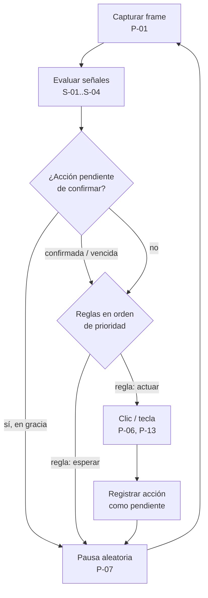
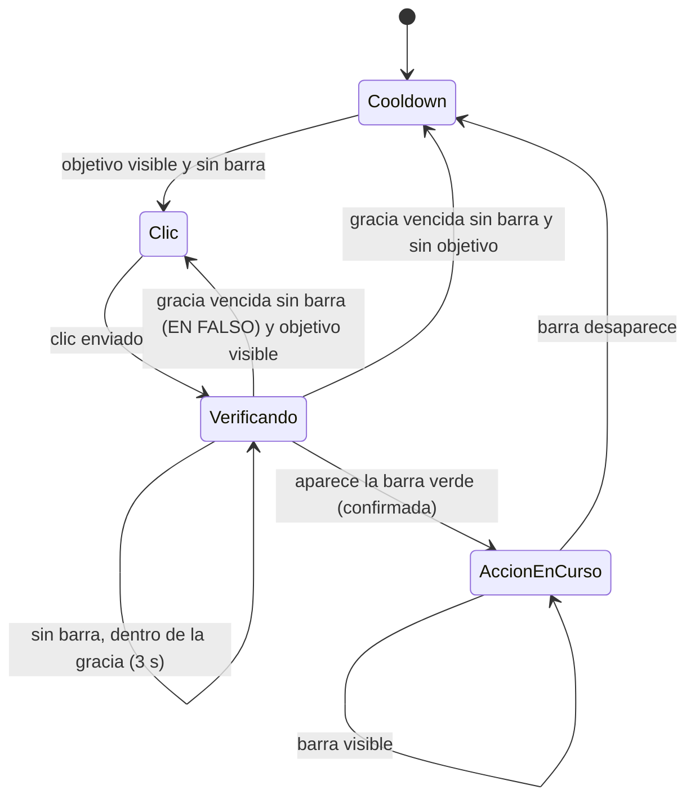
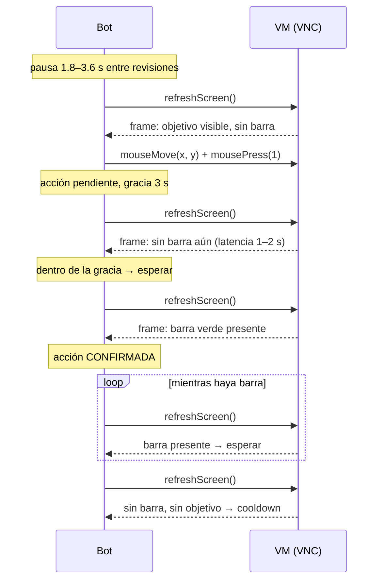
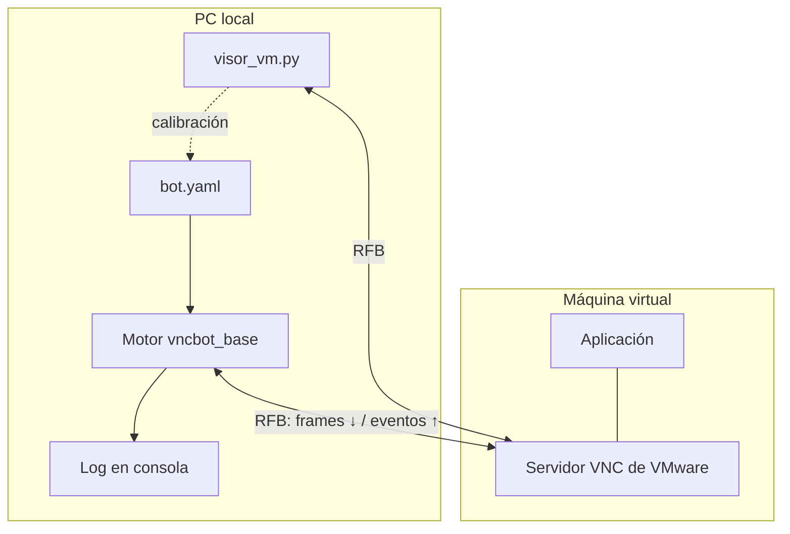
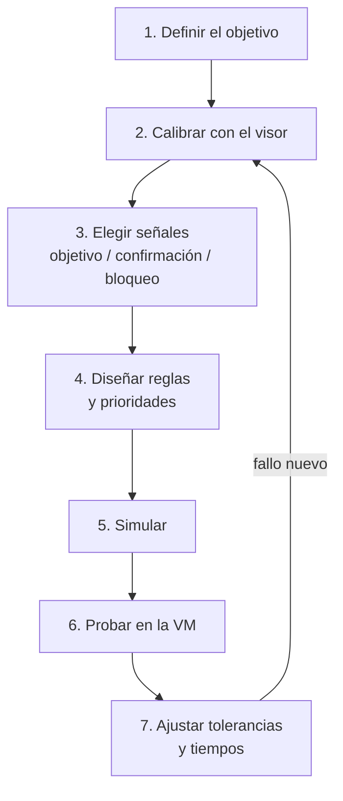

# 0. Cómo usar este documento

## 0.1 Propósito

Este documento describe una metodología para automatizar aplicaciones gráficas que corren dentro de una máquina virtual, controlándolas **desde afuera** mediante el protocolo VNC. La metodología se construyó de forma iterativa sobre un caso real (un bot que detecta un objetivo por color, le hace clic y verifica que la acción ocurrió) y aquí se abstrae para que pueda reutilizarse en cualquier caso similar.

Está escrito para dos tipos de lector:

- **Modelos de IA** que reciben este documento como contexto para diseñar, depurar o extender bots. Por eso usa identificadores estables, contratos explícitos y reglas de decisión sin ambigüedad.
- **Personas que programan en Python** y quieren entender, replicar o ampliar la metodología.

## 0.2 Alcance

| Incluido | Excluido |
|---|---|
| Control de VMs de VMware Workstation/Player/Fusion vía VNC | ESXi 7+ (sin VNC nativo; ver 2.3.3) |
| Percepción por color y por plantilla sobre el framebuffer | Visión por IA/redes neuronales (solo como estructura futura) |
| Lógica de decisión por reglas y estados | Automatización a nivel de sistema operativo (SSH, WinRM) |
| Verificación de acciones y detección de clics en falso | Evasión de sistemas anti-automatización |
| Herramientas de calibración y entorno de pruebas | |

## 0.3 Convenciones

**Identificadores.** Cada pieza reutilizable tiene un ID estable para citarla sin ambigüedad:

| Prefijo | Significado | Ejemplo |
|---|---|---|
| `P-xx` | Primitiva (función de percepción, acción o control) | P-05 búsqueda de objetivo |
| `S-xx` | Tipo de señal declarativa | S-01 presencia |
| `R-xx` | Regla de diseño o buena práctica | R-03 una captura por ciclo |
| `L-xx` | Lección aprendida / problema resuelto | L-02 BGRA vs RGB |
| `F-xx` | Estructura futura | F-01 configuración externa |
| `T-xx` | Tipo de bot (capacidad) | T-02 ciclo con confirmación |

**Coordenadas.** Siempre son coordenadas **de la VM** (píxeles del framebuffer VNC), origen `(0, 0)` en la esquina superior izquierda, `x` hacia la derecha, `y` hacia abajo. Nunca son coordenadas del monitor local.

**Cajas.** Una caja es `(x1, y1, x2, y2)` con **bordes incluidos**. La caja `(15, 103, 19, 123)` mide 5 × 21 = 105 píxeles. En numpy se recorta como `frame[y1:y2+1, x1:x2+1]`.

**Color.** Siempre `RGB` como tupla de 3 enteros 0–255. La tolerancia es la diferencia absoluta máxima **por canal**: el píxel `p` coincide con el color `c` si `|p.r−c.r| ≤ t` y `|p.g−c.g| ≤ t` y `|p.b−c.b| ≤ t`.

**Código.** Los fragmentos usan Python 3.10+ y los nombres del módulo base `vncbot_base.py` (Anexo A1). Dependencias: `vncdotool`, `numpy`, `pyyaml`; opcional `opencv-python`.

## 0.4 Orden de lectura según la tarea

| Tarea | Leer |
|---|---|
| Crear un bot nuevo | 3 → 4 → 6 → Anexo A1/A2 → Anexo C |
| Depurar un bot que falla | 10 (tabla de síntomas) → 4 (primitiva involucrada) → 2.4 |
| Entender por qué la arquitectura es así | 2 → 3 → 5.2 |
| Extender la metodología | 9 → 4 → Anexo A1 |
| Evaluar si un caso es automatizable | 7 → 8 |

## 0.5 Resumen en diez líneas (para contexto mínimo)

1. Se controla la VM por VNC con `vncdotool`; no se instala nada dentro de la VM.
2. La pantalla se lee del framebuffer VNC: `client.refreshScreen()` + `client.screen` (PIL, **RGB**).
3. La percepción se basa en **señales**: preguntas booleanas sobre colores dentro de cajas.
4. Una señal de tipo *objetivo* además entrega un punto donde hacer clic.
5. El bot es un ciclo: capturar → evaluar reglas en orden de prioridad → ejecutar la primera que aplica → pausa aleatoria.
6. Toda acción importante tiene una **señal de confirmación** y un **período de gracia**; si la confirmación no llega, la acción se marca *en falso* y se reintenta.
7. Los colores y coordenadas se calibran con un **visor** propio (`visor_vm.py`, tecla F6), nunca a ojo.
8. Todo bot se valida primero contra una **escena simulada** en un servidor VNC de prueba.
9. El bot se describe como datos (YAML): señales + reglas. El motor (`vncbot_base.py`) es genérico.
10. VMware no informa la posición del cursor por VNC; ESXi 7+ no tiene VNC.

# 1. Resumen ejecutivo

## 1.1 Qué es

Una metodología para construir **bots visuales remotos**: programas que observan la pantalla de una máquina virtual a través de VNC, deciden según lo que ven y actúan con el mouse o el teclado, verificando que cada acción tuvo efecto. Se resume en el ciclo:

> **Percibir → Decidir → Actuar → Verificar**

## 1.2 Qué problema resuelve

Automatizar una aplicación gráfica cuando:

- no hay API, línea de comandos ni acceso al código de la aplicación;
- no se quiere (o no se puede) instalar software dentro de la VM;
- la aplicación tiene estados visibles (colores, barras, indicadores) que permiten saber qué está pasando;
- las acciones pueden fallar silenciosamente y hace falta detectarlo.

Controlar la VM desde afuera tiene tres ventajas: el sistema invitado queda intacto, el bot funciona aunque la VM no tenga red ni herramientas instaladas, y la misma técnica sirve para cualquier sistema operativo invitado.

## 1.3 Qué la distingue de lo existente

Se revisó la documentación disponible del ecosistema VNC y de automatización visual. Ninguna fuente cubre la metodología completa; cada una cubre una capa.

| Fuente | Qué aporta | Qué no cubre |
|---|---|---|
| Especificación RFB (rfbproto) | El protocolo: mensajes, codificaciones, pseudo-codificaciones | Nada sobre automatización |
| Documentación de vncdotool | Comandos, API Python, captura, `expect` contra un PNG | Percepción por color, apuntado, estados, verificación |
| Documentación de VMware | Habilitar VNC (puerto, contraseña) y limitaciones | Cómo automatizar encima |
| Packer (`vmware-iso`) | Tecleo por VNC con pausas (`boot_command`) | Cualquier lectura de pantalla: teclea a ciegas |
| openQA / os-autoinst | Pruebas por VNC con *needles* (áreas de referencia, % de similitud, puntos de clic, OCR, áreas excluidas) | Ciclos continuos de bot; percepción por color; está orientado a pruebas con aserciones |
| SikuliX | Reconocimiento de imágenes, pantalla VNC opcional | Metodología de bot; es una API genérica |
| PyAutoGUI | `pixelMatchesColor` con tolerancia, `locateOnScreen` | VNC y pantallas remotas; solo pantalla local |

La contribución de esta metodología es la **integración** de las capas más las **lecciones prácticas** (capítulo 10): conexión, percepción por color con tolerancia, apuntado robusto, reglas por prioridad, verificación con período de gracia, calibración con visor y pruebas con escenas simuladas. openQA es el antecedente más cercano y más maduro en reconocimiento por imagen; varias estructuras futuras (capítulo 9) toman sus ideas.

## 1.4 Estado actual en una tabla

| Componente | Archivo | Estado |
|---|---|---|
| Núcleo reutilizable (primitivas + motor de reglas + YAML) | `vncbot_base.py` | Probado contra escena simulada |
| Configuración del bot actual | `bot.yaml` | Equivalente a `vnc_bot.py` |
| Bot autónomo de referencia | `vnc_bot.py` | En uso sobre la VM real |
| Visor de calibración | `visor_vm.py` | En uso sobre la VM real |
| Escena de pruebas | `escena_prueba.py` | Probada con Xtigervnc |

# 2. Fundamentos técnicos

## 2.1 VNC y el protocolo RFB en lo esencial

VNC (Virtual Network Computing) usa el protocolo **RFB** (Remote Framebuffer). Solo hace falta entender cinco conceptos:

| Concepto | Qué es | Relevancia para el bot |
|---|---|---|
| Framebuffer | La imagen completa de la pantalla remota, píxel a píxel | Es la única fuente de percepción |
| `FramebufferUpdateRequest` | Mensaje del cliente pidiendo una actualización; puede ser **completa** o **incremental** | `refreshScreen()` pide una completa y espera la respuesta |
| `PointerEvent` | Mensaje del cliente con la posición del puntero y el estado de los botones | `mouseMove` / `mousePress` |
| `KeyEvent` | Mensaje del cliente con una tecla presionada o soltada | `keyPress`, `keyDown`, `keyUp` |
| Pseudo-codificaciones | Capacidades opcionales que el cliente ofrece y el servidor puede aceptar | Determinan qué información extra envía el servidor |

Pseudo-codificaciones relevantes:

| Código | Nombre | Qué hace | Soporte observado |
|---|---|---|---|
| −239 | Cursor | El servidor envía la forma del cursor aparte (no la dibuja en el framebuffer) | vncdotool la soporta |
| −223 | DesktopSize | Avisa cambios de resolución | vncdotool la soporta |
| −224 | LastRect | Marca el fin de una actualización | vncdotool la soporta |
| −232 | PointerPos | El servidor informa la posición del cursor cuando cambia | **VMware no la envía** (ver L-06); vncdotool no la trae |

Puntos clave del modelo:

- El servidor **solo envía imagen cuando el cliente la pide**. Un bot que no llama a `refreshScreen()` trabaja con una imagen vieja.
- Una solicitud **incremental** solo recibe respuesta cuando algo cambió; puede bloquear indefinidamente si la pantalla está quieta. Por eso el bot usa solicitudes completas.
- La posición del cursor que conoce el cliente es **la última que el propio cliente envió**, no la real si otra persona mueve el mouse.

Referencia completa: especificación RFB en `github.com/rfbproto/rfbproto`.

## 2.2 vncdotool

### 2.2.1 Qué es

Cliente VNC en Python con dos modos: línea de comandos (`vncdo`) y librería. Internamente usa **Twisted** (asíncrono), pero ofrece una capa síncrona: `api.connect()` arranca el reactor de Twisted en un hilo aparte y devuelve un *proxy* cuyos métodos bloquean hasta completar.

### 2.2.2 API usada por la metodología

| Llamada | Efecto | Notas |
|---|---|---|
| `api.connect("host::puerto", password=...)` | Conecta y devuelve el cliente | `::` indica puerto; `:` indica número de display (5900 + n) |
| `client.refreshScreen()` | Pide una actualización completa y espera | Tras volver, `client.screen` está al día |
| `client.screen` | `PIL.Image` en modo **RGB** con la pantalla completa | Acceso directo al atributo del protocolo |
| `client.mouseMove(x, y)` | Mueve el puntero | Coordenadas de la VM |
| `client.mousePress(1)` | Clic (bajar + subir) del botón 1 | 1 = izquierdo, 2 = medio, 3 = derecho |
| `client.keyPress("enter")` | Pulsa y suelta una tecla | Nombres de tecla de vncdotool (`enter`, `tab`, `f1`, `ctrl-alt-del`) |
| `client.captureRegion(archivo, x, y, w, h)` | Guarda una región como PNG | Útil para crear plantillas |
| `client.expectRegion(archivo, x, y)` | Bloquea hasta que la región coincida con el PNG | Coincidencia por histograma (RMS) |
| `api.shutdown()` | Detiene el reactor y su hilo | **Obligatorio**; sin esto el proceso no termina |

### 2.2.3 Contratos importantes

- **Un solo hilo por cliente.** El proxy síncrono usa una cola interna de resultados; llamar métodos del mismo cliente desde dos hilos a la vez mezcla las respuestas. Si hay un hilo de captura (como en el visor), **todas** las llamadas al cliente deben ir por ese hilo.
- **Inicializar el puntero.** El primer clic puede fallar si el cliente nunca envió una posición; por eso los scripts hacen `client.mouseMove(0, 0)` al conectar.
- **Cierre.** `api.shutdown()` en un bloque `finally`.

## 2.3 VMware y VNC

### 2.3.1 Habilitar VNC en una VM

En el archivo `.vmx` (con la VM apagada):

```
RemoteDisplay.vnc.enabled = "TRUE"
RemoteDisplay.vnc.port = "5900"
RemoteDisplay.vnc.password = "123456"
```

O desde la interfaz: *VM Settings → Options → VNC Connections → Enable VNC connections*. Con varias VMs en el mismo host, cada una necesita un puerto distinto (rango habitual 5900–6001).

### 2.3.2 Qué ofrece el servidor VNC de VMware

- Acceso a la consola virtual desde el arranque (BIOS, instalador, sistema operativo), sin nada instalado en el invitado.
- Funciona aunque la ventana de VMware esté minimizada: basta con que la VM esté encendida.
- **No envía la posición del cursor** (sin `PointerPos`). Consecuencia: un cliente VNC no puede saber dónde está el cursor si alguien lo mueve desde la consola de VMware. Ver L-06 y 5.1.
- Tráfico **sin cifrar**. Usar solo en `localhost`, red de gestión o túnel SSH.
- El control por VNC no puede encender/apagar la VM ni tomar snapshots; eso se hace con `vmrun` (ver F-12).

### 2.3.3 ESXi 7 y posteriores

Desde vSphere 7.0 el servidor VNC integrado de ESXi fue eliminado. `vncdotool` habla RFB sobre TCP plano y **no puede conectarse** a un ESXi 7/8. Las alternativas (ticket WebMKS + proxy websocket, servidor VNC dentro del invitado) cambian la metodología y quedan fuera de alcance.

## 2.4 Modelo de color y coordenadas

### 2.4.1 RGB frente a BGRA

| Fuente de imagen | Orden de canales |
|---|---|
| `client.screen` (vncdotool) → `np.asarray` | **RGB** |
| `mss` (captura local) | **BGRA** |
| OpenCV (`cv2.imread`) | **BGR** |
| PIL `Image.open(...).convert("RGB")` | **RGB** |

Regla R-01: el framebuffer VNC ya está en RGB; **nunca invertir canales** al comparar. El código heredado de `mss` compara `[:, :, 0]` con el canal azul; copiado tal cual sobre VNC, nunca encuentra el color (L-02).

### 2.4.2 Coordenadas de la VM

Las coordenadas del framebuffer son las del escritorio del invitado a su resolución real. No coinciden con las del monitor local salvo que la VM esté en pantalla completa sin escalado. Un visor que muestra la VM reducida debe dividir por la escala para obtener coordenadas reales (así lo hace `visor_vm.py`). En invitados Windows con escalado DPI (125 %, 150 %), el framebuffer está en píxeles físicos.

### 2.4.3 El cursor en el framebuffer

Según las codificaciones negociadas, el servidor puede **dibujar el cursor dentro del framebuffer**. Consecuencias:

- Tras un clic, el cursor queda sobre el objetivo y tapa algunos píxeles. Con cajas y umbrales razonables no afecta, pero una caja diminuta bajo el cursor puede dar un falso "Not Found".
- Para leer el color "debajo" del cursor sin interferencia, el cliente puede pedir la pseudo-codificación Cursor (−239) y no dibujar el cursor.

## 2.5 Rendimiento de referencia

Medido contra un servidor Xtigervnc local a 1600 × 900:

| Operación | Tiempo típico |
|---|---|
| `refreshScreen()` completo | 15–80 ms |
| Máscara de color sobre pantalla completa (numpy) | 10–30 ms |
| `buscar_objetivo` sobre 1232 × 765 | 20–40 ms |
| Clic (`mouseMove` + `mousePress`) hasta que la app lo recibe | ~40 ms |

Con pausas de 1.8–3.6 s entre ciclos, el costo de percepción es despreciable. Si se necesitan ciclos de menos de 200 ms, conviene recortar la captura a la zona de interés (F-06).
# 3. Arquitectura actual

## 3.1 El patrón Percibir → Decidir → Actuar → Verificar

Todo bot de esta metodología es un **ciclo** con cuatro fases. Cada fase tiene una responsabilidad única y se comunica con la siguiente solo mediante datos:

| Fase | Entrada | Salida | Implementación |
|---|---|---|---|
| **Percibir** | Conexión VNC | Un frame (array RGB) y las señales evaluadas sobre él | `capturar` (P-01) + `Lectura` con señales (S-01…S-04) |
| **Decidir** | Señales activas/inactivas | La regla a ejecutar (o ninguna) | Lista de reglas por prioridad; gana la primera que aplica |
| **Actuar** | Regla + punto de acción | Evento de mouse/teclado enviado a la VM | `_ejecutar` (P-06, P-13) |
| **Verificar** | Frames posteriores | Acción confirmada / en falso | Señal de confirmación + período de gracia (P-08, P-09) |



Principios de la arquitectura:

- **R-02 Percepción y decisión separadas.** Las funciones de percepción no hacen clic; las reglas no leen píxeles directamente, solo consultan señales.
- **R-03 Una captura por ciclo.** Todas las señales de un ciclo se evalúan sobre el mismo frame. Evita decidir con una imagen y apuntar con otra.
- **R-04 Mismo criterio para decidir y para apuntar.** Si una señal dice "hay objetivo", la misma función entrega dónde está. Nunca un check con tolerancia 0 y un apuntado con tolerancia 5.
- **R-05 Toda acción importante se verifica.** Una acción sin confirmación puede haber fallado sin que nadie se entere.
- **R-06 El ritmo es aleatorio y acotado.** Pausa uniforme entre un mínimo y un máximo; nunca un intervalo fijo.

## 3.2 El bot actual como máquina de estados

El bot en uso (`vnc_bot.py`, y su equivalente declarativo `bot.yaml`) automatiza una aplicación con tres elementos visuales:

- un **objetivo** cyan `(0, 255, 255)` que aparece en una zona de la pantalla;
- una **barra de acción** verde `(6, 138, 53)` que aparece 1–2 s después de un clic válido y se vacía mientras dura la acción;
- un **cooldown** tras cada acción, durante el cual no hay objetivo.



Reglas en orden de prioridad:

| Prioridad | Regla | Condición | Acción | Verificación |
|---|---|---|---|---|
| 1 | `accion_en_curso` | barra verde presente | esperar | — |
| 2 | `clic_objetivo` | objetivo presente | clic en el objetivo | barra verde en ≤ 3 s |
| 3 | `cooldown` | (siempre) | esperar | — |

## 3.3 Secuencia temporal de un ciclo real



## 3.4 Componentes

| Componente | Responsabilidad | Depende de |
|---|---|---|
| `vncbot_base.py` | Primitivas, señales, motor de reglas, carga de YAML | vncdotool, numpy, pyyaml, (opencv) |
| `bot.yaml` | Describe **qué** hace un bot concreto: conexión, ritmo, señales, reglas | — |
| `visor_vm.py` | Calibración: muestra la VM, F6 imprime coordenadas y RGB | vncdotool, pillow, tkinter |
| `escena_prueba.py` | Simula la aplicación en un servidor VNC de prueba | tkinter |
| `vnc_bot.py` | Implementación autónoma de referencia (sin YAML) | vncdotool, numpy |

La separación **motor genérico + configuración** es la pieza central: crear un bot nuevo significa escribir un YAML nuevo, no un script nuevo. El motor solo cambia cuando hace falta un **tipo** nuevo de señal o de acción.

## 3.5 Flujo de datos



# 4. Catálogo de primitivas

Cada primitiva se documenta con: **propósito**, **contrato** (entradas, salida, garantías), **parámetros**, **código esencial**, **cuándo usarla** y **fallos típicos**. El código completo está en el Anexo A1.

## 4.1 Percepción

### P-01 Captura

- **Propósito:** obtener el estado actual de la pantalla de la VM.
- **Contrato:** `capturar(client) -> np.ndarray` de forma `(alto, ancho, 3)`, `uint8`, **RGB**, recién pedido al servidor.
- **Garantía:** el frame refleja lo que el servidor tenía al responder. No garantiza que la aplicación haya terminado de redibujar (ver P-12).

```python
def capturar(client):
    client.refreshScreen()
    return np.asarray(client.screen, dtype=np.uint8)
```

- **Fallos típicos:** servidores que responden con un framebuffer propio atrasado (x11vnc llegó a entregar imágenes con ~1.5 s de retraso; L-08). VMware mantiene su propio framebuffer y no presentó ese problema.

### Base común: máscara de color

Todas las primitivas de color se apoyan en la misma operación:

```python
def mascara(region, rgb, tolerancia):
    diff = np.abs(region.astype(np.int16) - np.array(rgb, dtype=np.int16))
    return np.all(diff <= tolerancia, axis=-1)
```

El `astype(np.int16)` es obligatorio: restar `uint8` desborda (5 − 10 = 251).

### P-02 Presencia en caja

- **Propósito:** responder "¿aparece este color en esta caja?".
- **Contrato:** `presente(frame, caja, rgb, tolerancia=0, min_pixeles=1) -> bool`.
- **Cuándo usarla:** indicadores que existen o no existen (iconos de estado, barras que se vacían, avisos).

```python
def presente(frame, caja, rgb, tolerancia=0, min_pixeles=1):
    return contar(frame, caja, rgb, tolerancia) >= min_pixeles
```

### P-03 Conteo

- **Propósito:** cuántos píxeles del color hay en la caja. Base de P-02 y útil para diagnóstico (se imprime en el log).
- **Contrato:** `contar(frame, caja, rgb, tolerancia=0) -> int`.

```python
def contar(frame, caja, rgb, tolerancia=0):
    region, _, _ = recortar(frame, caja)   # caja con bordes incluidos
    return int(mascara(region, rgb, tolerancia).sum())
```

### P-04 Proporción

- **Propósito:** qué fracción de la caja está cubierta por el color.
- **Contrato:** `proporcion(frame, caja, rgb, tolerancia=0) -> float` en [0, 1].
- **Cuándo usarla:** barras de progreso con umbral ("vida bajo 30 %"), confirmar que un elemento está *completo* y no solo presente.
- **Fallo típico:** usarla con una caja más grande que el elemento; la proporción nunca llega al umbral.

### P-05 Búsqueda de objetivo

- **Propósito:** encontrar dónde hacer clic sobre un objeto de un color.
- **Contrato:** `buscar_objetivo(frame, zona, rgb, tolerancia=0, min_pixeles=15, celda=16) -> (x, y, n) | None`. Si devuelve un punto, ese punto **es un píxel del color** y pertenece al objeto de mayor masa.
- **Algoritmo:**
  1. Máscara del color dentro de la zona.
  2. Si hay menos de `min_pixeles`, no hay objetivo (filtro de ruido).
  3. Suma de la máscara por celdas de `celda × celda` píxeles.
  4. Suma de cada celda con sus 8 vecinas; se elige la celda con más masa. Así, con varios objetos, se apunta al más grande y no al punto medio entre ellos.
  5. Centroide de los píxeles del color en esa vecindad.
  6. Ajuste al píxel del color más cercano al centroide (en objetos con forma de anillo o "C" el centroide cae fuera del color).

```python
m = mascara(region, rgb, tolerancia)
if m.sum() < min_pixeles:
    return None
celdas = pad.reshape(gh, celda, gw, celda).sum(axis=(1, 3))
v = sum(desplazar(celdas, dy, dx) for dy in (-1, 0, 1) for dx in (-1, 0, 1))
cy, cx = np.unravel_index(np.argmax(v), v.shape)
ys, xs = np.nonzero(m[vecindad_de(cy, cx)])
i = np.argmin((ys - ys.mean())**2 + (xs - xs.mean())**2)
return xs[i] + ox, ys[i] + oy, len(xs)
```

| Parámetro | Valor típico | Efecto al subirlo |
|---|---|---|
| `tolerancia` | 3–10 | Acepta más tonos (bordes suavizados); riesgo de confundir colores vecinos |
| `min_pixeles` | 10–30 | Ignora motas; riesgo de ignorar objetivos pequeños |
| `celda` | 16 | Agrupa objetos más separados como uno solo |

- **Validación:** con un objetivo de 70 × 50 px en tres posiciones y un distractor de 10 × 10 px del mismo color, el 100 % de los clics cayó sobre el objetivo principal.

### P-11 Búsqueda por plantilla

- **Propósito:** localizar un elemento por su **forma y textura** cuando el color no basta (iconos, botones con texto).
- **Contrato:** `buscar_plantilla(frame, zona, plantilla, umbral=0.9) -> (x, y, score) | None`, con `(x, y)` el centro de la mejor coincidencia. Requiere `opencv-python`.
- **Crear la plantilla:** `client.captureRegion("boton.png", x, y, w, h)` con la VM en el estado deseado.

```python
res = cv2.matchTemplate(region, plantilla, cv2.TM_CCOEFF_NORMED)
_, score, _, (mx, my) = cv2.minMaxLoc(res)
return None if score < umbral else (mx + pw // 2 + ox, my + ph // 2 + oy, score)
```

- **Fallos típicos:** plantilla capturada a otra resolución o con el cursor encima; umbral demasiado alto con elementos animados.

### P-12 Esperar pantalla estable

- **Propósito:** esperar a que una zona deje de cambiar antes de decidir (animaciones, transiciones, carga). Equivale a `wait_still_screen` de openQA.
- **Contrato:** `esperar_estable(client, caja=None, quieto=1.0, timeout=30.0, intervalo=0.2, tolerancia=0) -> bool`. `True` si la zona estuvo `quieto` segundos sin cambios; `False` si venció el `timeout`.
- **Validación:** con una animación de ~2.3 s devolvió `True` a los ~3.2 s (animación + 1 s de quietud); sobre una zona ya quieta devolvió `True` al cumplir el segundo de quietud.

## 4.2 Acción

### P-06 Clic dirigido

```python
client.mouseMove(x, y)
client.mousePress(1)
```

- **Contrato:** el clic se envía en coordenadas de la VM. No garantiza que la aplicación lo haya procesado; eso lo decide P-08.
- **Regla R-07:** después de conectar, `client.mouseMove(0, 0)` una vez, antes del primer clic.

### P-13 Tecla

```python
client.keyPress("enter")        # también "tab", "esc", "f1", "ctrl-alt-del"
```

## 4.3 Control

### P-07 Pausa aleatoria

```python
time.sleep(random.uniform(PAUSA_MIN, PAUSA_MAX))   # p. ej. 1.8–3.6 s
```

- **Propósito:** ritmo no mecánico y margen para que la aplicación reaccione.
- **Regla:** el mínimo debe superar la latencia típica de la aplicación; el período de gracia (P-08) cubre la latencia de confirmación.

### P-08 Verificación con período de gracia

- **Propósito:** confirmar que una acción surtió efecto, tolerando la latencia de la aplicación.
- **Contrato:** tras la acción, la acción queda **pendiente**. En cada ciclo:
  - si la señal de confirmación está activa → **confirmada**;
  - si no, y no pasó la gracia → esperar (no ejecutar otras reglas);
  - si no, y pasó la gracia → **en falso** (P-09) y se vuelven a evaluar las reglas.
- **Cálculo de la gracia:** latencia máxima observada de la confirmación + un margen de ~1 s. En el caso real la barra tarda 1–2 s: gracia = 3 s.

```python
activa, _, det = lectura(senal_confirmacion)
if activa:                       estado = "confirmada"
elif ahora - t_accion < gracia:  estado = "verificando"   # no actuar
else:                            estado = "en_falso"      # reevaluar reglas
```

### P-09 Detección de acción en falso y reintento

- **Propósito:** recuperarse de clics que la aplicación ignoró.
- **Mecanismo:** no hay lógica de reintento aparte; al marcar la acción como en falso, el ciclo reevalúa las reglas y, si el objetivo sigue visible, la regla de clic vuelve a aplicar. El reintento es consecuencia de la prioridad de las reglas.
- **Métrica:** el contador `en_falso` del resumen final mide la fiabilidad real de la acción.

### P-10 Registro

- Una línea por **cambio** de estado, no por ciclo (evita ruido).
- Cada acción registra punto y detalle numérico de la señal (`objetivo: 1930` px); cada confirmación registra el detalle de la señal de confirmación (`accion_en_curso: 4656`). Con eso se diagnostica sin reproducir el problema.
- Resumen al salir: `{'acciones': n, 'confirmadas': n, 'en_falso': n}`.

### P-14 Watchdog

- **Propósito:** detectar que el bot quedó atascado (nada que hacer durante demasiado tiempo: la app se cerró, cambió de pantalla, apareció un diálogo).
- **Contrato:** si pasan `watchdog` segundos sin ninguna acción, registra un aviso y reinicia el contador. En la base solo avisa; ver F-09 para respuestas automáticas.

## 4.4 Señales declarativas

Una **señal** es una pregunta con nombre sobre la pantalla. Se define como datos y la evalúa el motor.

| ID | Tipo | Pregunta | Parámetros | Entrega punto |
|---|---|---|---|---|
| S-01 | `presencia` | ¿hay ≥ `min_pixeles` del color en la caja? | caja, color, tolerancia, min_pixeles | No |
| S-02 | `proporcion` | ¿la caja está cubierta ≥ `umbral` por el color? | caja, color, tolerancia, umbral | No |
| S-03 | `objetivo` | ¿hay un objeto del color en la zona? ¿dónde? | caja (zona), color, tolerancia, min_pixeles, celda | Sí |
| S-04 | `plantilla` | ¿aparece esta imagen en la zona? ¿dónde? | caja (zona), imagen, umbral | Sí |

Contrato de evaluación: `Senal.evaluar(frame) -> (activa: bool, punto: (x, y) | None, detalle: int | float)`. La clase `Lectura` aplica caché: cada señal se evalúa **una sola vez por frame** aunque varias reglas la consulten.

Roles de las señales dentro de un bot:

| Rol | Pregunta que responde | Ejemplo actual |
|---|---|---|
| **Objetivo** | ¿Sobre qué actúo y dónde? | `objetivo` (cyan) |
| **Confirmación** | ¿Mi acción surtió efecto? | `accion_en_curso` (barra verde) |
| **Bloqueo** | ¿Hay algo que me impide actuar ahora? | `accion_en_curso` (mientras hay barra, no se hace clic) |
| **Contexto** | ¿Estoy en la pantalla correcta? | (futuro: menú abierto, diálogo visible) |

Una misma señal puede cumplir varios roles: la barra verde es a la vez confirmación del clic y bloqueo de nuevos clics.

## 4.5 Reglas

```yaml
- nombre: clic_objetivo
  si: [objetivo]                 # todas activas
  si_no: [dialogo_error]         # todas inactivas (opcional)
  hacer: {clic: objetivo}        # esperar | {clic: señal} | {clic_en: [x, y]} | {tecla: "enter"}
  confirmar: {senal: accion_en_curso, gracia: 3.0}
```

Semántica:

1. Las reglas se evalúan en el orden del archivo; se ejecuta **la primera** que aplica.
2. Una regla sin `si` ni `si_no` siempre aplica: sirve como regla final por defecto (`cooldown`).
3. Mientras haya una acción pendiente dentro de su gracia, **no se evalúa ninguna regla**.
4. El motor valida al cargar que todas las señales referenciadas existen; un nombre mal escrito es un error inmediato, no un bot que nunca actúa.
# 5. Herramientas de apoyo

## 5.1 Visor de calibración (`visor_vm.py`)

### Problema que resuelve

Para definir señales hacen falta coordenadas y colores **exactos de la VM**. Medirlos en el monitor local no sirve: las coordenadas no coinciden (2.4.2) y la captura local puede alterar el color. Además, el servidor VNC de VMware no informa dónde está el cursor (L-06), así que no se puede "apuntar dentro de la VM y leer".

### Solución

Un visor VNC propio: una ventana en el PC local que muestra la pantalla de la VM. Al pasar el mouse por encima, el visor convierte la posición de la ventana a coordenadas de la VM (dividiendo por la escala si la ventana está reducida) y lee el color del frame original.

| Tecla | Efecto |
|---|---|
| F6 | Imprime en consola `#n  VM x=… y=…  RGB=(…)  #HEX` del píxel bajo el mouse |
| F7 | Activa/desactiva que el cursor real de la VM siga al del visor |
| Esc | Cierra el visor |

El título de la ventana muestra la lectura en vivo; la consola solo imprime con F6, para registrar puntos concretos sin ruido.

### Diseño interno

- Un **hilo de captura** es el único que habla con el cliente VNC (contrato 2.2.3): aplica los movimientos pendientes (F7) y pide frames en bucle.
- El **hilo de la interfaz** (tkinter) solo lee el último frame bajo un `Lock` y lo pinta a 30 fps.
- El color se lee del frame a resolución real, nunca de la imagen escalada.

### Procedimiento de calibración

1. Abrir el visor con la aplicación en el estado que se quiere detectar.
2. Para un **color**: marcar con F6 varios puntos del elemento, incluidos los bordes. Si aparecen variantes (`(6,138,53)` y `(6,139,52)`), la tolerancia debe cubrir la diferencia máxima más un margen.
3. Para una **caja**: marcar con F6 varias veces la esquina superior izquierda y la inferior derecha. Repetir la misma coordenada confirma que no hubo movimiento accidental.
4. Para una **zona de búsqueda**: marcar los límites del área útil, excluyendo menús o paneles que contengan el mismo color.
5. Anotar los valores directamente en el YAML.

## 5.2 Enfoques descartados y por qué

Documentar lo que no funcionó evita repetirlo.

| Enfoque | Idea | Resultado | Motivo |
|---|---|---|---|
| Leer el cursor local con `mss` + `pynput` | Leer posición y color en el PC local | Descartado | Mide el monitor local, no la VM |
| Extensión `PointerPos` (−232) sobre vncdotool | El servidor VNC informa la posición del cursor | Funciona con x11vnc; **no con VMware** | VMware no envía esa pseudo-codificación (probado: 10 s sin ninguna posición) |
| Agente dentro de la VM (UDP al PC local) | Script en el invitado que lee su cursor | Funcional pero descartado | Requiere instalar software en la VM; contradice el objetivo |
| **Visor propio** | Mostrar la VM y medir sobre la ventana | **Adoptado** | Sin instalar nada en la VM; coordenadas exactas |

## 5.3 Entorno de pruebas

### Por qué simular

Probar directamente sobre la aplicación real es lento (hay que esperar cooldowns reales), poco repetible y no permite provocar fallos a voluntad. Una escena simulada reproduce los elementos visuales con los **mismos colores y coordenadas** que la aplicación real y permite inyectar fallos: clics ignorados, latencias, objetos que cambian de lugar.

### Componentes

| Pieza | Función |
|---|---|
| Servidor VNC de prueba | Xtigervnc (Linux): el propio servidor X es el servidor VNC, sin retraso de captura |
| `escena_prueba.py` | Ventana tkinter a pantalla completa que dibuja la aplicación ficticia y registra cada clic recibido |
| Bot bajo prueba | El mismo `vncbot_base.py` + YAML que se usará en la VM real |

La escena imprime eventos con marca de tiempo (`objetivo APARECE`, `clic #2 sobre objetivo`, `barra VERDE`); el bot imprime su log. Comparar ambos logs valida el comportamiento.

### Puesta en marcha (Linux)

```bash
echo 123456 | vncpasswd -f > ~/.vnc/passwd && chmod 600 ~/.vnc/passwd
Xtigervnc :50 -geometry 1600x900 -depth 24 -rfbport 5900 \
          -rfbauth ~/.vnc/passwd -SecurityTypes VncAuth &
DISPLAY=:50 python escena_prueba.py 60 &
python vncbot_base.py bot.yaml
```

### Advertencia: no todos los servidores sirven para probar

x11vnc captura la pantalla X **sondeándola**; en reposo reduce la frecuencia de sondeo y entregó frames con ~1.5 s de retraso. En las pruebas, eso produjo clics sobre posiciones donde el objetivo ya no estaba. Con Xtigervnc, que es el servidor X, el mismo bot acertó el 100 % de los clics. Regla R-08: probar con un servidor que sea dueño de su framebuffer (Xtigervnc, QEMU, VMware), no con uno que lo copie (x11vnc).

### Resultado de referencia

Log real del motor YAML contra `escena_prueba.py` (primer clic ignorado a propósito):

```
23:59:18  [clic_objetivo] CLIC en (334, 328) (objetivo: 1930)
   4.1 [escena] clic #1 (334,328) sobre objetivo -> IGNORADO (clic en falso simulado)
23:59:23  [clic_objetivo] EN FALSO: 'accion_en_curso' no apareció en 3.0s
23:59:23  [clic_objetivo] CLIC en (334, 328) (objetivo: 1930)
   9.4 [escena] clic #2 (334,328) sobre objetivo -> acción inicia en 1.5s
  10.9 [escena] barra VERDE (acción en curso)
23:59:25  [clic_objetivo] confirmada (accion_en_curso: 4656)
23:59:32  estado: cooldown
23:59:38  [clic_objetivo] CLIC en (831, 524) (objetivo: 2097)
23:59:40  [clic_objetivo] confirmada (accion_en_curso: 4176)
```

# 6. Metodología de desarrollo paso a paso



## Paso 1. Definir el objetivo

Escribir en una frase qué debe lograr el bot y cómo se ve en pantalla que lo logró. Ejemplo: *"Hacer clic en el objetivo cyan cada vez que aparezca; el clic es válido si en 1–2 s aparece la barra verde."* Si no se puede describir cómo se ve el éxito, no se puede verificar (R-05).

## Paso 2. Calibrar

Con el visor (5.1): colores reales con F6 en varios puntos, esquinas de cada caja, límites de la zona de búsqueda. Nunca usar colores estimados o copiados de otra herramienta.

## Paso 3. Elegir las señales

Para cada elemento visual, decidir su rol (4.4) y su tipo:

| Si el elemento… | Tipo de señal |
|---|---|
| existe o no existe (indicador, barra que se vacía) | S-01 presencia |
| debe superar un nivel (barra de vida al 30 %) | S-02 proporción |
| es un objeto de color sobre el que hay que actuar | S-03 objetivo |
| se distingue por forma, no por color | S-04 plantilla |

## Paso 4. Diseñar reglas y prioridades

Ordenar las reglas de la más restrictiva a la más general:

1. **Bloqueos primero**: si algo impide actuar, esperar.
2. **Acciones** con su verificación.
3. **Regla por defecto** al final (esperar).

Preguntas de control:

- ¿Qué pasa si el objetivo y el bloqueo aparecen a la vez? (el orden decide)
- ¿Cuánto tarda la confirmación en el peor caso? (define la gracia)
- ¿Qué pasa si la acción falla siempre? (el contador `en_falso` sube; considerar F-09)

## Paso 5. Simular

Adaptar `escena_prueba.py` con los mismos colores y coordenadas calibrados. Incluir al menos: un clic ignorado, un cambio de posición del objetivo, un distractor del mismo color fuera de la zona.

## Paso 6. Probar en la VM

Correr el bot con el log visible. Criterio de aceptación: `en_falso` bajo y explicable; ningún clic mientras la señal de bloqueo está activa.

## Paso 7. Ajustar

Usar el detalle numérico del log para decidir:

| Observación en el log | Ajuste |
|---|---|
| `EN FALSO` con `0 px` mientras el elemento se ve en pantalla | Color o caja mal calibrados → volver al paso 2 |
| `EN FALSO` frecuente con confirmación que sí llega después | Gracia corta → subir `gracia` |
| Clics sobre elementos que no son el objetivo | Zona demasiado amplia o tolerancia alta |
| Objetivo visible pero nunca detectado | Tolerancia baja o `min_pixeles` alto |

### Caso real que ilustra el paso 7

La barra verde se definió primero como `(7, 140, 56)` con tolerancia 2. El bot marcó todos los clics como en falso. Con el visor se midió el color real: `(6, 138, 53)`. La diferencia en azul (56 − 53 = 3) superaba la tolerancia, así que ningún píxel coincidía. Corrección: color medido, tolerancia 5, caja ampliada a la barra completa `(18, 101, 218, 124)` y regla "≥ 1 píxel". Detalle en L-04.

# 7. Capacidades: qué se puede construir hoy

Con las primitivas actuales (sin estructuras futuras) se pueden construir estos tipos de bot. Cada uno se expresa con el motor y un YAML.

## T-01 Clic reactivo

Hace clic sobre un objetivo cada vez que aparece. Sin verificación. Útil cuando la acción es inocua si falla.

```yaml
reglas:
  - {nombre: clic, si: [objetivo], hacer: {clic: objetivo}}
  - {nombre: esperar, hacer: esperar}
```

## T-02 Ciclo con confirmación (el bot actual)

Clic + señal de confirmación + gracia + bloqueo mientras dura la acción. Recupera clics en falso automáticamente.

## T-03 Monitoreo con alerta

No actúa; vigila un indicador y registra cuándo cambia (por ejemplo, un aviso rojo). Combinado con el watchdog, detecta que la aplicación dejó de responder.

```yaml
reglas:
  - {nombre: ALERTA_aviso_rojo, si: [aviso_rojo], hacer: esperar}
  - {nombre: normal, hacer: esperar}
```

El cambio de estado queda en el log con hora (`estado: ALERTA_aviso_rojo`).

## T-04 Mantenimiento de umbral

Actúa cuando un recurso baja de un nivel: señal S-02 sobre una barra, acción de tecla o clic sobre un punto fijo.

```yaml
senales:
  recurso_ok: {tipo: proporcion, caja: [20, 60, 220, 70], color: [200, 30, 30], tolerancia: 10, umbral: 0.3}
reglas:
  - {nombre: reponer, si_no: [recurso_ok], hacer: {tecla: "f1"},
     confirmar: {senal: recurso_ok, gracia: 2.0}}
  - {nombre: esperar, hacer: esperar}
```

## T-05 Secuencia guiada por pantalla

Varios pasos donde cada pantalla tiene una señal propia (menú, diálogo, confirmación). Las reglas se ordenan de la pantalla más avanzada a la más temprana; el bot avanza porque en cada ciclo aplica la regla de la pantalla que está viendo.

```yaml
reglas:
  - {nombre: cerrar_confirmacion, si: [dialogo_ok], hacer: {clic: boton_ok}}
  - {nombre: aceptar_menu,        si: [menu_abierto], hacer: {clic: opcion}}
  - {nombre: abrir_menu,          si: [pantalla_inicio], hacer: {clic_en: [40, 20]}}
  - {nombre: esperar, hacer: esperar}
```

## T-06 Automatización de arranque e instalación

Teclear durante la BIOS, el gestor de arranque o un instalador, como Packer, pero esperando a que cada pantalla aparezca (S-04 plantilla o S-01 sobre un elemento característico) en lugar de teclear a ciegas.

## Evaluación de viabilidad

| Tipo | Dificultad | Fiabilidad esperada | Requisito clave |
|---|---|---|---|
| T-01 Clic reactivo | Baja | Media | Color del objetivo único en la zona |
| T-02 Ciclo con confirmación | Media | Alta | Señal de confirmación visible y estable |
| T-03 Monitoreo | Baja | Alta | Indicador de color constante |
| T-04 Umbral | Media | Alta | Barra de color sólido |
| T-05 Secuencia | Media-alta | Media-alta | Una señal distintiva por pantalla |
| T-06 Arranque | Media | Alta | Plantillas capturadas a la misma resolución |

Un caso **no** es adecuado para esta metodología cuando: el estado no se ve en pantalla; los colores cambian constantemente (iluminación dinámica, efectos); se necesita reaccionar en menos de ~100 ms; o hace falta leer texto variable (ver F-05).

# 8. Limitaciones y riesgos técnicos

| Limitación | Consecuencia | Mitigación |
|---|---|---|
| Dependencia del color exacto | Un cambio de tema, brillo o filtro rompe las señales | Calibrar con el visor; tolerancia con margen; S-04 cuando el color no basta |
| Dependencia de la resolución | Cajas y zonas quedan desplazadas | Fijar la resolución del invitado; recalibrar si cambia |
| Latencia de la aplicación | Clics juzgados como falsos antes de tiempo | Período de gracia (P-08) |
| Frames atrasados de algunos servidores | Decisiones sobre una imagen vieja | Usar servidores dueños de su framebuffer (R-08); P-12 si hay animaciones |
| Cursor dibujado en el framebuffer | Puede tapar cajas diminutas | Cajas razonables; umbral por conteo, no por un solo píxel |
| Colores repetidos fuera del objetivo | Clics en menús o paneles | Restringir la zona de búsqueda; F-07 áreas excluidas |
| Elementos animados o con degradado | Tolerancia insuficiente | Medir varios puntos; tolerancia mayor; S-02 con umbral |
| Sin posición real del cursor en VMware | No se puede leer "dónde apunta el usuario" | Visor propio (5.1) |
| VNC sin cifrado | Contraseña y pantalla visibles en la red | Solo `localhost` o túnel SSH |
| ESXi 7+ sin VNC | La metodología no conecta | Workstation/Fusion/Player u otro hipervisor con VNC nativo |
| Un solo cliente, un solo hilo | Llamadas concurrentes corrompen respuestas | Un hilo por conexión (2.2.3); F-03 para varias VMs |
# 9. Estructuras futuras

Cada estructura se describe con: qué resuelve, diseño, código esencial (solo cuando aporta), esfuerzo y prioridad. Esfuerzo: **B** (horas), **M** (1–2 días), **A** (varios días). Dos estructuras ya quedaron implementadas en la base durante la redacción de este documento y se marcan como tales.

## Hoja de ruta

| ID | Estructura | Resuelve | Esfuerzo | Prioridad | Estado |
|---|---|---|---|---|---|
| F-01 | Configuración externa (YAML) | Bots nuevos sin código nuevo | M | — | **Implementada** (motor base) |
| F-04 | Señal por plantilla | Elementos sin color distintivo | B | — | **Implementada** (P-11, S-04) |
| F-07 | Áreas excluidas | Clics en menús con el mismo color | B | Alta | Propuesta |
| F-10 | Pausa/reanudación por tecla | Intervenir sin matar el proceso | B | Alta | Propuesta |
| F-11 | Registro de eventos en CSV | Medir fiabilidad y tiempos | B | Alta | Propuesta |
| F-02 | Estados explícitos | Secuencias que dependen de lo que ya pasó | M | Alta | Propuesta |
| F-09 | Watchdog con recuperación | Salir solo de pantallas inesperadas | M | Media | Propuesta |
| F-13 | Registro de tipos (plugins) | Extender señales/acciones sin tocar el motor | B | Media | Propuesta |
| F-08 | Estabilidad como condición de regla | Decidir solo sobre pantallas quietas | B | Media | Propuesta |
| F-03 | Varias VMs en paralelo | Escalar a N instancias | M | Media | Propuesta |
| F-12 | Integración con `vmrun` | Snapshots, reinicio, recuperación total | M | Media | Propuesta |
| F-05 | OCR | Leer números y texto | M | Baja | Propuesta |
| F-06 | Captura parcial | Ciclos rápidos (< 200 ms) | M | Baja | Propuesta |
| F-14 | Detección por componentes | Varios objetivos separados, forma y tamaño | M | Baja | Propuesta |

## F-01 Configuración externa (implementada)

El bot se describe en YAML (señales + reglas + ritmo + watchdog) y el motor lo ejecuta. Esquema completo en el Anexo B. Validación al cargar: toda señal referenciada debe existir.

## F-04 Señal por plantilla (implementada)

Tipo `plantilla` con `imagen` y `umbral`. La plantilla se captura con `client.captureRegion(...)`. Ver P-11.

```yaml
boton_ok: {tipo: plantilla, caja: [400, 300, 900, 600], imagen: "boton_ok.png", umbral: 0.9}
```

## F-07 Áreas excluidas

**Resuelve:** el color del objetivo aparece también en un menú o panel dentro de la zona de búsqueda. Idea tomada de las *exclude areas* de openQA.

**Diseño:** campo opcional `excluir: [[x1, y1, x2, y2], ...]` en la señal; las cajas excluidas se ponen en `False` en la máscara antes de buscar.

```python
def aplicar_exclusiones(m, ox, oy, excluir):
    for x1, y1, x2, y2 in excluir or []:
        m[max(0, y1 - oy):y2 - oy + 1, max(0, x1 - ox):x2 - ox + 1] = False
    return m
```

Se llama dentro de `buscar_objetivo` y `contar` justo después de `mascara(...)`.

## F-10 Pausa y reanudación por tecla

**Resuelve:** detener el bot un momento (para intervenir manualmente) sin cerrarlo y sin perder contadores.

**Diseño:** una bandera compartida que alterna una tecla global del PC local; el ciclo no evalúa reglas mientras está en pausa.

```python
import keyboard                      # pip install keyboard (en Windows no requiere admin)
pausado = False
def alternar():
    global pausado
    pausado = not pausado
    log("PAUSA" if pausado else "REANUDADO")
keyboard.add_hotkey("f8", alternar)

# dentro del ciclo, antes de capturar:
if pausado:
    time.sleep(0.2)
    continue
```

## F-11 Registro de eventos en CSV

**Resuelve:** el log de consola sirve para mirar; un CSV sirve para medir (tasa de clics en falso, tiempo por ciclo, duración de cooldowns).

```python
import csv
class Registro:
    def __init__(self, ruta):
        self.f = open(ruta, "a", newline="", encoding="utf-8")
        self.w = csv.writer(self.f)
    def evento(self, tipo, regla="", x="", y="", detalle=""):
        self.w.writerow([time.time(), tipo, regla, x, y, detalle])
        self.f.flush()
# tipos: accion | confirmada | en_falso | estado | watchdog
```

Métricas directas: `en_falso / acciones`, tiempo medio entre `accion` y `confirmada`, distribución de duraciones de cooldown.

## F-02 Estados explícitos

**Resuelve:** las reglas por prioridad deciden solo con lo que se ve ahora. Algunas tareas dependen de lo que ya pasó ("después de abrir el menú, elegir la opción 3; si ya se eligió, cerrar"). Ahí hace falta memoria: un estado actual.

**Diseño:** cada estado tiene su propia lista de reglas; una regla puede declarar `ir_a`. La lista de reglas activa es la del estado actual.

```yaml
estado_inicial: buscar
estados:
  buscar:
    - {nombre: abrir, si: [objetivo], hacer: {clic: objetivo}, ir_a: en_menu,
       confirmar: {senal: menu_abierto, gracia: 2.0}}
    - {nombre: esperar, hacer: esperar}
  en_menu:
    - {nombre: elegir, si: [opcion], hacer: {clic: opcion}, ir_a: buscar}
    - {nombre: timeout_menu, si_no: [menu_abierto], hacer: esperar, ir_a: buscar}
```

```python
reglas = self.estados[self.estado]
regla = next((r for r in reglas if r.aplica(lec)), None)
if regla:
    self._ejecutar(client, regla, lec)
    if regla.ir_a and not regla.confirmar:
        self.estado = regla.ir_a          # con confirmar: cambiar al confirmarse
```

Regla de diseño: si la acción tiene `confirmar`, la transición `ir_a` debe hacerse al **confirmar**, no al ejecutar; si se marca en falso, se permanece en el estado de origen.

## F-09 Watchdog con recuperación

**Resuelve:** la base solo avisa. Un watchdog con recuperación ejecuta una escalera de respuestas cuando el bot lleva demasiado tiempo sin actuar.

**Diseño:** lista ordenada de acciones de recuperación; cada disparo del watchdog ejecuta la siguiente.

```yaml
watchdog:
  segundos: 300
  recuperacion:
    - {tecla: "esc"}
    - {clic_en: [640, 400]}
    - {vmrun: "revert", snapshot: "base"}     # requiere F-12
```

## F-13 Registro de tipos (plugins)

**Resuelve:** agregar un tipo de señal o de acción sin editar el motor.

```python
TIPOS_SENAL = {}
def tipo_senal(nombre):
    def registrar(fn):
        TIPOS_SENAL[nombre] = fn
        return fn
    return registrar

@tipo_senal("presencia")
def _presencia(s, frame):
    n = contar(frame, s.caja, s.color, s.tolerancia)
    return n >= s.min_pixeles, None, n

# Senal.evaluar pasa a ser:
def evaluar(self, frame):
    return TIPOS_SENAL[self.tipo](self, frame)
```

Un plugin es un archivo `.py` con funciones decoradas que el motor importa al arrancar.

## F-08 Estabilidad como condición de regla

**Resuelve:** decidir sobre pantallas en transición (fundidos, animaciones de apertura).

**Diseño:** opción `estable: {caja: [...], quieto: 1.0}` en una regla; antes de ejecutar, el motor llama a P-12 y descarta la acción si la zona no se estabiliza. Costo: el ciclo se alarga hasta `quieto` segundos cuando la regla aplica.

## F-03 Varias VMs en paralelo

**Resuelve:** operar N instancias a la vez.

**Diseño:** un **proceso** por VM (no hilos: el reactor de Twisted de vncdotool es uno por proceso, y el proxy síncrono no admite concurrencia). Cada VM con su puerto VNC y su YAML.

```python
from multiprocessing import Process
import vncbot_base as vb

def correr(ruta):
    vb.cargar(ruta).correr()

if __name__ == "__main__":
    procesos = [Process(target=correr, args=(r,)) for r in ["vm1.yaml", "vm2.yaml"]]
    for p in procesos: p.start()
    for p in procesos: p.join()
```

Requisitos: puertos VNC distintos por VM (5901, 5902, …); prefijo de VM en el log.

## F-12 Integración con `vmrun`

**Resuelve:** operaciones que VNC no puede hacer: encender, apagar, snapshots, revertir.

```python
import subprocess
VMRUN = r"C:\Program Files (x86)\VMware\VMware Workstation\vmrun.exe"
def vmrun(*args):
    return subprocess.run([VMRUN, "-T", "ws", *args], capture_output=True, text=True, check=True)

vmrun("revertToSnapshot", r"C:\VMs\app\app.vmx", "base")
vmrun("start", r"C:\VMs\app\app.vmx", "nogui")
```

Tras un `revert` o `start`, reconectar VNC y esperar una señal de "aplicación lista" antes de reanudar reglas.

## F-05 OCR

**Resuelve:** leer números o texto variable (contadores, mensajes).

```python
import pytesseract                     # requiere Tesseract instalado
from PIL import Image
def leer_texto(frame, caja, solo_digitos=False):
    region, _, _ = recortar(frame, caja)
    img = Image.fromarray(region).convert("L").resize(
        (region.shape[1] * 3, region.shape[0] * 3))   # escalar mejora la precisión
    cfg = "--psm 7" + (" -c tessedit_char_whitelist=0123456789" if solo_digitos else "")
    return pytesseract.image_to_string(img, config=cfg).strip()
```

Uso como señal: tipo `texto` con `patron` (expresión regular) o `min`/`max` numéricos.

## F-06 Captura parcial

**Resuelve:** con ciclos muy cortos, pedir la pantalla completa es el costo dominante. RFB permite pedir solo un rectángulo (`FramebufferUpdateRequest` con `x, y, w, h`). Requiere extender el cliente de vncdotool para esperar la respuesta de una región. Solo vale la pena por debajo de ~200 ms por ciclo.

## F-14 Detección por componentes

**Resuelve:** P-05 elige el objeto de mayor masa. Si hay varios objetivos y hay que elegir por otro criterio (el más cercano, el de cierto tamaño, todos en orden), hace falta separar la máscara en objetos individuales.

```python
from scipy import ndimage
etiquetas, n = ndimage.label(m)
objetos = ndimage.find_objects(etiquetas)               # cajas de cada objeto
tamanos = ndimage.sum(m, etiquetas, range(1, n + 1))    # píxeles por objeto
centros = ndimage.center_of_mass(m, etiquetas, range(1, n + 1))
```

Criterios de selección posibles: tamaño en un rango, más cercano al último clic, más cercano al centro de la pantalla, orden de lectura.

# 10. Buenas prácticas y solución de problemas

## 10.1 Reglas de oro

| ID | Regla |
|---|---|
| R-01 | El framebuffer VNC es RGB: no invertir canales. |
| R-02 | Percepción y decisión separadas: las reglas consultan señales, no píxeles. |
| R-03 | Una captura por ciclo; todas las señales sobre el mismo frame. |
| R-04 | El mismo criterio decide y apunta. |
| R-05 | Toda acción importante tiene señal de confirmación y período de gracia. |
| R-06 | Ritmo aleatorio acotado entre un mínimo y un máximo. |
| R-07 | `mouseMove(0, 0)` al conectar, antes del primer clic. |
| R-08 | Probar con servidores VNC dueños de su framebuffer (Xtigervnc, QEMU, VMware). |
| R-09 | Colores y coordenadas se miden con el visor, nunca a ojo. |
| R-10 | Tolerancia ≥ diferencia máxima medida entre variantes del color + margen. |
| R-11 | `api.shutdown()` siempre en `finally`. |
| R-12 | Un hilo por conexión VNC; un proceso por VM. |
| R-13 | Registrar el detalle numérico de cada señal usada en una decisión. |
| R-14 | Log por cambio de estado, no por ciclo. |

## 10.2 Lecciones aprendidas

| ID | Problema | Causa | Solución |
|---|---|---|---|
| L-01 | La condición de color nunca se cumple en el primer intento | Código copiado de `mss` compara canales invertidos | Comparar RGB directo (R-01) |
| L-02 | Coordenadas medidas no funcionan en el bot | Se midieron en el monitor local | Medir con el visor en coordenadas de la VM |
| L-03 | El proceso no termina con Ctrl+C | Reactor de Twisted en un hilo no-daemon | `api.shutdown()` en `finally` (R-11) |
| L-04 | Todos los clics marcados "en falso" | Color de confirmación mal medido: `(7,140,56)` vs real `(6,138,53)`, tolerancia 2 | Medir con F6; tolerancia 5; caja completa de la barra |
| L-05 | Check "Found" pero el clic no encuentra dónde apuntar | Criterios distintos (tolerancia 0 vs 5, sin mínimo de píxeles) | Una sola función para decidir y apuntar (R-04) |
| L-06 | No se puede leer la posición del cursor de la VM | VMware no envía `PointerPos` (−232) | Visor propio (5.1) |
| L-07 | Clics dobles sobre una acción que sí había empezado | Juzgar el clic antes de que la app muestre la confirmación | Período de gracia ≥ latencia máxima + margen |
| L-08 | Clics en posiciones donde el objetivo ya no está (en pruebas) | x11vnc entrega frames con ~1.5 s de retraso | Probar con Xtigervnc (R-08) |
| L-09 | Respuestas cruzadas o bloqueos en el visor | Dos hilos usando el mismo cliente VNC | Todas las llamadas por un único hilo (R-12) |
| L-10 | `refreshScreen(incremental=True)` bloquea | El servidor no responde si nada cambió | Usar solicitudes completas |

## 10.3 Tabla de diagnóstico

| Síntoma | Causa probable | Verificación | Solución |
|---|---|---|---|
| `EN FALSO` con `0 px` y el elemento visible | Color o caja incorrectos | F6 sobre el elemento; comparar con el YAML | Recalibrar (paso 2) |
| `EN FALSO` y la confirmación aparece después | Gracia corta | Comparar horas del clic y de la aparición | Subir `gracia` |
| Clic en lugares sin objetivo | Color repetido en la zona | Revisar la zona con el visor | Reducir zona; F-07 |
| Objetivo visible, nunca detectado | Tolerancia baja o `min_pixeles` alto | Log de `contar` sobre la zona | Ajustar tolerancia/umbral |
| El bot no hace nada y no hay errores | Regla de bloqueo siempre activa | Estado en el log (`accion_en_curso` permanente) | Revisar color/caja del bloqueo |
| `ValueError: ... señal inexistente` al arrancar | Nombre mal escrito en el YAML | Mensaje indica regla y señal | Corregir el nombre |
| `ConnectionRefusedError` | VNC no habilitado, puerto o VM apagada | `vncdo -s host::puerto capture x.png` | Revisar `.vmx` y puerto |
| El primer clic no se registra | Puntero sin inicializar | — | `mouseMove(0, 0)` al conectar (R-07) |
| El proceso queda colgado al salir | Falta `api.shutdown()` | — | R-11 |
# 11. Uso responsable

Esta metodología controla aplicaciones como lo haría una persona frente a la pantalla. Eso la hace útil y, a la vez, exige criterio sobre dónde usarla.

**Entornos apropiados:**

- Pruebas de software e interfaces propias o con autorización (QA, regresión visual).
- Automatización de tareas repetitivas en aplicaciones propias o de la organización.
- Laboratorios, instalaciones desatendidas y aprovisionamiento de VMs (T-06).
- Monitoreo de sistemas propios (T-03).

**Términos de servicio.** Muchas aplicaciones y servicios en línea, en especial juegos multijugador, prohíben expresamente la automatización en sus términos de uso. Usar un bot en esos entornos puede terminar en la suspensión de la cuenta y afectar a otros usuarios. Antes de automatizar una aplicación de terceros, revisar sus términos. Este documento no cubre técnicas para ocultar la automatización ni para evadir sistemas de detección, y las estructuras futuras no incluyen ninguna.

**Seguridad.** VNC transmite pantalla y contraseña sin cifrar: exponerlo fuera de `localhost` o de una red de gestión da control total de la VM a cualquiera en la red. Usar un túnel SSH para acceso remoto y contraseñas distintas por VM.

# 12. Glosario

| Término | Definición |
|---|---|
| **Acción pendiente** | Acción ejecutada que aún no fue confirmada ni declarada en falso |
| **Bloqueo (señal de)** | Señal cuya presencia impide actuar (p. ej., acción en curso) |
| **Caja** | Rectángulo `(x1, y1, x2, y2)` con bordes incluidos, en coordenadas de la VM |
| **Clic en falso** | Clic que la aplicación no procesó; se detecta porque la señal de confirmación no aparece dentro de la gracia |
| **Confirmación (señal de)** | Señal que demuestra que una acción surtió efecto |
| **Cooldown** | Período en que no hay nada que hacer; el bot espera |
| **Framebuffer** | Imagen completa de la pantalla remota que mantiene el servidor VNC |
| **Frame** | Una captura del framebuffer como array RGB |
| **Gracia (período de)** | Tiempo tras una acción durante el cual la ausencia de confirmación no se considera fallo |
| **Lectura** | Evaluación de las señales sobre un frame, con caché |
| **Máscara** | Matriz booleana de píxeles que coinciden con un color dentro de la tolerancia |
| **Motor** | Código genérico que ejecuta un bot descrito en YAML (`vncbot_base.py`) |
| **Plantilla** | Imagen de referencia que se busca en la pantalla (template matching) |
| **Primitiva** | Función reutilizable de percepción, acción o control (P-xx) |
| **Pseudo-codificación** | Capacidad opcional de RFB negociada entre cliente y servidor |
| **Regla** | Par condición → acción; se ejecuta la primera que aplica |
| **RFB** | Remote Framebuffer, el protocolo de VNC |
| **Señal** | Pregunta con nombre sobre la pantalla con respuesta booleana (S-xx) |
| **Tolerancia** | Diferencia máxima por canal para considerar dos colores iguales |
| **Visor** | Herramienta de calibración que muestra la VM y mide coordenadas y colores |
| **Watchdog** | Vigilante que detecta que el bot lleva demasiado tiempo sin actuar |
| **Zona** | Caja donde se busca un objetivo |

# Anexo A. Código base

Código completo tal como fue probado. Cada archivo es independiente salvo que se indique.

## A1. Núcleo reutilizable: `vncbot_base.py`

Motor genérico: primitivas P-01 a P-14, señales S-01 a S-04, reglas, verificación y carga de YAML. Probado contra `escena_prueba.py` y con pruebas unitarias de cada primitiva.

```python
"""
vncbot_base — núcleo reutilizable de la metodología Percibir -> Decidir -> Actuar -> Verificar.

Contiene:
  * Conexión VNC (vncdotool) con cierre garantizado.
  * Primitivas de percepción sobre el framebuffer RGB (P-01 a P-05, P-11, P-12).
  * Señales declarativas (Senal) evaluadas con caché por frame.
  * Motor de reglas por prioridad con verificación de acciones y watchdog (Bot).
  * Carga de la configuración desde YAML.

Uso:
    python vncbot_base.py bot.yaml

Dependencias: pip install vncdotool numpy pyyaml   (opcional: opencv-python para plantillas)
"""
from __future__ import annotations

import random
import sys
import time
from dataclasses import dataclass, field

import numpy as np
from vncdotool import api

RGB = tuple[int, int, int]
Caja = tuple[int, int, int, int]  # (x1, y1, x2, y2) con bordes INCLUIDOS, coordenadas de la VM


# ============================================================================
# Registro
# ============================================================================
def log(msg: str) -> None:
    print(f"{time.strftime('%H:%M:%S')}  {msg}", flush=True)


# ============================================================================
# Percepción (primitivas)
# ============================================================================
def capturar(client) -> np.ndarray:
    """P-01. Pide un frame nuevo y lo devuelve como array (alto, ancho, 3) uint8 en RGB."""
    client.refreshScreen()
    return np.asarray(client.screen, dtype=np.uint8)


def recortar(frame: np.ndarray, caja: Caja | None) -> tuple[np.ndarray, int, int]:
    """Recorta la caja (bordes incluidos). Devuelve (sub-array, offset_x, offset_y)."""
    if caja is None:
        return frame, 0, 0
    x1, y1, x2, y2 = caja
    return frame[y1:y2 + 1, x1:x2 + 1], x1, y1


def mascara(region: np.ndarray, rgb: RGB, tolerancia: int) -> np.ndarray:
    """Matriz booleana: True donde |pixel - rgb| <= tolerancia en los tres canales."""
    diff = np.abs(region.astype(np.int16) - np.array(rgb, dtype=np.int16))
    return np.all(diff <= tolerancia, axis=-1)


def contar(frame: np.ndarray, caja: Caja | None, rgb: RGB, tolerancia: int = 0) -> int:
    """P-03. Cantidad de píxeles del color dentro de la caja."""
    region, _, _ = recortar(frame, caja)
    return int(mascara(region, rgb, tolerancia).sum())


def presente(frame, caja, rgb, tolerancia=0, min_pixeles=1) -> bool:
    """P-02. True si hay al menos min_pixeles del color en la caja."""
    return contar(frame, caja, rgb, tolerancia) >= min_pixeles


def proporcion(frame, caja, rgb, tolerancia=0) -> float:
    """P-04. Fracción (0-1) de la caja cubierta por el color."""
    region, _, _ = recortar(frame, caja)
    return float(mascara(region, rgb, tolerancia).mean())


def buscar_objetivo(frame, zona, rgb, tolerancia=0, min_pixeles=15, celda=16):
    """
    P-05. Localiza el objeto más grande del color dentro de la zona.
    Devuelve (x, y, n_pixeles) con (x, y) sobre un píxel del color, o None.
    Algoritmo: máscara -> suma por celdas -> celda con más masa (con vecinas)
               -> centroide local -> píxel del color más cercano al centroide.
    """
    region, ox, oy = recortar(frame, zona)
    m = mascara(region, rgb, tolerancia)
    if int(m.sum()) < min_pixeles:
        return None
    h, w = m.shape
    gh, gw = -(-h // celda), -(-w // celda)
    pad = np.zeros((gh * celda, gw * celda), dtype=np.int32)
    pad[:h, :w] = m
    celdas = pad.reshape(gh, celda, gw, celda).sum(axis=(1, 3))
    v = np.pad(celdas, 1)
    v = sum(v[1 + dy:1 + dy + gh, 1 + dx:1 + dx + gw] for dy in (-1, 0, 1) for dx in (-1, 0, 1))
    cy, cx = np.unravel_index(np.argmax(v), v.shape)
    y0, y1 = max(0, (cy - 1) * celda), min(h, (cy + 2) * celda)
    x0, x1 = max(0, (cx - 1) * celda), min(w, (cx + 2) * celda)
    ys, xs = np.nonzero(m[y0:y1, x0:x1])
    ys, xs = ys + y0, xs + x0
    i = np.argmin((ys - ys.mean()) ** 2 + (xs - xs.mean()) ** 2)
    return int(xs[i]) + ox, int(ys[i]) + oy, int(len(xs))


def buscar_plantilla(frame, zona, plantilla: np.ndarray, umbral: float = 0.9):
    """
    P-11. Template matching (requiere opencv-python). Devuelve (x, y, score) del centro
    de la mejor coincidencia si score >= umbral, o None. 'plantilla' es RGB uint8.
    """
    import cv2
    region, ox, oy = recortar(frame, zona)
    res = cv2.matchTemplate(region, plantilla, cv2.TM_CCOEFF_NORMED)
    _, score, _, (mx, my) = cv2.minMaxLoc(res)
    if score < umbral:
        return None
    ph, pw = plantilla.shape[:2]
    return mx + pw // 2 + ox, my + ph // 2 + oy, float(score)


def esperar_estable(client, caja=None, quieto=1.0, timeout=30.0, intervalo=0.2, tolerancia=0) -> bool:
    """
    P-12. Bloquea hasta que la caja no cambie durante 'quieto' segundos (pantalla estable).
    Devuelve True si se estabilizó, False si venció el timeout.
    """
    inicio = time.monotonic()
    previo, desde = None, time.monotonic()
    while time.monotonic() - inicio < timeout:
        actual, _, _ = recortar(capturar(client), caja)
        if previo is None or np.abs(actual.astype(np.int16) - previo).max() > tolerancia:
            previo, desde = actual.astype(np.int16), time.monotonic()
        elif time.monotonic() - desde >= quieto:
            return True
        time.sleep(intervalo)
    return False


# ============================================================================
# Señales declarativas
# ============================================================================
@dataclass
class Senal:
    """
    Una pregunta sobre la pantalla con respuesta booleana (y, si es 'objetivo'/'plantilla',
    un punto donde actuar).
      tipo = presencia  -> contar(caja) >= min_pixeles
             proporcion -> proporcion(caja) >= umbral
             objetivo   -> buscar_objetivo(zona) no es None      (aporta punto de clic)
             plantilla  -> buscar_plantilla(zona) no es None     (aporta punto de clic)
    """
    nombre: str
    tipo: str
    caja: Caja | None = None
    color: RGB | None = None
    tolerancia: int = 0
    min_pixeles: int = 1
    umbral: float = 0.9
    celda: int = 16
    imagen: str | None = None
    _plantilla: np.ndarray | None = field(default=None, repr=False)

    def evaluar(self, frame: np.ndarray):
        """Devuelve (activa: bool, punto: (x, y) | None, detalle: int|float)."""
        if self.tipo == "presencia":
            n = contar(frame, self.caja, self.color, self.tolerancia)
            return n >= self.min_pixeles, None, n
        if self.tipo == "proporcion":
            p = proporcion(frame, self.caja, self.color, self.tolerancia)
            return p >= self.umbral, None, round(p, 3)
        if self.tipo == "objetivo":
            r = buscar_objetivo(frame, self.caja, self.color, self.tolerancia, self.min_pixeles, self.celda)
            return (True, r[:2], r[2]) if r else (False, None, 0)
        if self.tipo == "plantilla":
            if self._plantilla is None:
                from PIL import Image
                self._plantilla = np.asarray(Image.open(self.imagen).convert("RGB"), dtype=np.uint8)
            r = buscar_plantilla(frame, self.caja, self._plantilla, self.umbral)
            return (True, r[:2], round(r[2], 3)) if r else (False, None, 0)
        raise ValueError(f"Tipo de señal desconocido: {self.tipo}")


class Lectura:
    """Evalúa señales sobre UN frame, con caché (cada señal se calcula una vez por ciclo)."""

    def __init__(self, frame: np.ndarray, senales: dict[str, Senal]):
        self.frame, self.senales, self._cache = frame, senales, {}

    def __call__(self, nombre: str):
        if nombre not in self._cache:
            self._cache[nombre] = self.senales[nombre].evaluar(self.frame)
        return self._cache[nombre]

    def activa(self, nombre: str) -> bool:
        return self(nombre)[0]


# ============================================================================
# Motor de reglas
# ============================================================================
@dataclass
class Regla:
    """
    Se evalúan en orden; se ejecuta la PRIMERA cuya condición se cumple.
      si       : señales que deben estar activas (todas)
      si_no    : señales que deben estar inactivas (todas)
      hacer    : "esperar" | {"clic": <señal con punto>} | {"clic_en": [x, y]} | {"tecla": "enter"}
      confirmar: {"senal": <nombre>, "gracia": s}  -> verifica que la acción surtió efecto
    """
    nombre: str
    hacer: object = "esperar"
    si: list[str] = field(default_factory=list)
    si_no: list[str] = field(default_factory=list)
    confirmar: dict | None = None

    def aplica(self, lec: Lectura) -> bool:
        return all(lec.activa(s) for s in self.si) and not any(lec.activa(s) for s in self.si_no)


class Bot:
    def __init__(self, cfg: dict):
        con = cfg["conexion"]
        self.server, self.password = con["server"], con.get("password")
        ritmo = cfg.get("ritmo", {})
        self.pausa_min, self.pausa_max = ritmo.get("min", 1.8), ritmo.get("max", 3.6)
        self.watchdog = cfg.get("watchdog")  # s sin acciones antes de avisar (None = off)
        self.senales = {n: Senal(nombre=n, **_tuplas(d)) for n, d in cfg["senales"].items()}
        self.reglas = [Regla(**r) for r in cfg["reglas"]]
        self._validar()
        self.pendiente = None  # (regla, t_accion) de una acción esperando confirmación
        self.stats = {"acciones": 0, "confirmadas": 0, "en_falso": 0}

    def _validar(self):
        for r in self.reglas:
            usadas = r.si + r.si_no + ([r.confirmar["senal"]] if r.confirmar else [])
            if isinstance(r.hacer, dict) and "clic" in r.hacer:
                usadas.append(r.hacer["clic"])
            for s in usadas:
                if s not in self.senales:
                    raise ValueError(f"Regla '{r.nombre}' usa la señal inexistente '{s}'")

    # --- actuar -------------------------------------------------------------
    def _ejecutar(self, client, regla: Regla, lec: Lectura) -> bool:
        h = regla.hacer
        if h == "esperar":
            return False
        if "clic" in h:
            activa, punto, det = lec(h["clic"])
            if not activa or punto is None:
                return False
            client.mouseMove(*punto)
            client.mousePress(1)
            log(f"[{regla.nombre}] CLIC en {punto} ({h['clic']}: {det})")
        elif "clic_en" in h:
            client.mouseMove(*h["clic_en"])
            client.mousePress(1)
            log(f"[{regla.nombre}] CLIC en {tuple(h['clic_en'])}")
        elif "tecla" in h:
            client.keyPress(h["tecla"])
            log(f"[{regla.nombre}] TECLA {h['tecla']}")
        else:
            raise ValueError(f"Acción desconocida en '{regla.nombre}': {h}")
        return True

    # --- verificar ----------------------------------------------------------
    def _verificar(self, lec: Lectura) -> bool:
        """Devuelve True si hay que esperar (acción en período de gracia sin confirmar)."""
        if not self.pendiente:
            return False
        regla, t = self.pendiente
        senal, gracia = regla.confirmar["senal"], regla.confirmar.get("gracia", 3.0)
        activa, _, det = lec(senal)
        if activa:
            self.stats["confirmadas"] += 1
            log(f"[{regla.nombre}] confirmada ({senal}: {det})")
            self.pendiente = None
            return False
        if time.monotonic() - t < gracia:
            return True
        self.stats["en_falso"] += 1
        log(f"[{regla.nombre}] EN FALSO: '{senal}' no apareció en {gracia}s")
        self.pendiente = None
        return False

    # --- ciclo --------------------------------------------------------------
    def correr(self):
        client = api.connect(self.server, password=self.password)
        ultima_accion, estado_previo = time.monotonic(), None
        try:
            client.mouseMove(0, 0)  # inicializa el puntero (evita que falle el primer clic)
            log(f"Bot iniciado: {len(self.senales)} señales, {len(self.reglas)} reglas. Ctrl+C para salir.")
            while True:
                lec = Lectura(capturar(client), self.senales)
                if self._verificar(lec):
                    estado = "verificando"
                else:
                    regla = next((r for r in self.reglas if r.aplica(lec)), None)
                    estado = regla.nombre if regla else "(ninguna)"
                    if regla and self._ejecutar(client, regla, lec):
                        self.stats["acciones"] += 1
                        ultima_accion = time.monotonic()
                        if regla.confirmar:
                            self.pendiente = (regla, ultima_accion)
                if estado != estado_previo:
                    log(f"estado: {estado}")
                    estado_previo = estado
                if self.watchdog and time.monotonic() - ultima_accion > self.watchdog:
                    log(f"WATCHDOG: {self.watchdog}s sin acciones (estado '{estado}')")
                    ultima_accion = time.monotonic()
                time.sleep(random.uniform(self.pausa_min, self.pausa_max))
        except KeyboardInterrupt:
            print(f"\nFin. {self.stats}")
        finally:
            api.shutdown()


def _tuplas(d: dict) -> dict:
    """Convierte listas YAML a tuplas en caja/color."""
    return {k: (tuple(v) if k in ("caja", "color") and v is not None else v) for k, v in d.items()}


def cargar(ruta: str) -> Bot:
    import yaml
    with open(ruta, encoding="utf-8") as f:
        return Bot(yaml.safe_load(f))


if __name__ == "__main__":
    cargar(sys.argv[1] if len(sys.argv) > 1 else "bot.yaml").correr()
```

## A2. Configuración del bot actual: `bot.yaml`

El bot actual expresado como datos. Ejecutar con `python vncbot_base.py bot.yaml`.

```yaml
# Bot "objetivo cyan con barra de confirmación" expresado como datos.
# Equivale a vnc_bot.py. Coordenadas = VM; cajas con bordes incluidos: [x1, y1, x2, y2].

conexion:
  server: "localhost::5900"
  password: "123456"

ritmo:            # pausa aleatoria entre ciclos (s)
  min: 1.8
  max: 3.6

watchdog: 300     # avisa si pasan 300 s sin ninguna acción (null = desactivado)

senales:
  accion_en_curso:          # barra verde: hay acción en progreso
    tipo: presencia
    caja: [18, 101, 218, 124]
    color: [6, 138, 53]
    tolerancia: 5
    min_pixeles: 1

  objetivo:                 # objeto cyan sobre el que se hace clic
    tipo: objetivo
    caja: [6, 36, 1238, 801]
    color: [0, 255, 255]
    tolerancia: 5
    min_pixeles: 15

reglas:                     # prioridad = orden; se ejecuta la primera que aplica
  - nombre: accion_en_curso
    si: [accion_en_curso]
    hacer: esperar

  - nombre: clic_objetivo
    si: [objetivo]
    hacer: {clic: objetivo}
    confirmar: {senal: accion_en_curso, gracia: 3.0}

  - nombre: cooldown
    hacer: esperar
```

## A3. Visor de calibración: `visor_vm.py`

Herramienta de calibración (5.1). F6 imprime coordenadas de la VM y RGB; F7 hace que el cursor de la VM siga al del visor.

```python
"""
VISOR — se ejecuta en tu PC LOCAL. No se instala nada en la VM.

Abre una ventana con la pantalla de la VM (vía VNC). Al pasar el mouse
por encima, el título de la ventana muestra en vivo las coordenadas DE LA
VM y el color RGB de ese píxel; en el cmd solo se imprime al presionar F6.
Las coordenadas sirven directo para mouseMove() y para ZONA/BOX.

Teclas (con la ventana enfocada):
  F6   imprime en el cmd la posición y el color bajo el mouse
  F7   activa/desactiva mover el cursor real de la VM junto con el tuyo
  Esc  salir

pip install vncdotool pillow
"""
import queue
import threading
import time
import tkinter as tk

from PIL import ImageTk
from vncdotool import api

SERVER = "localhost::5900"
PASSWORD = "123456"
FPS_VISOR = 30            # refresco de la ventana
MOVER_CURSOR_VM = False   # F7 lo cambia en vivo


class Visor:
    def __init__(self):
        self.client = api.connect(SERVER, password=PASSWORD)
        self.frame = None                 # última captura (PIL RGB, resolución real)
        self.lock = threading.Lock()
        self.movimientos = queue.Queue()  # movimientos a enviar a la VM
        self.vivo = True
        self.mover = MOVER_CURSOR_VM
        self.pos = None
        self.ultimo = None
        self.marcas = 0

        threading.Thread(target=self._capturar, daemon=True).start()
        while self.frame is None:         # espera el primer frame
            time.sleep(0.05)

        self.root = tk.Tk()
        w, h = self.frame.size
        sw, sh = self.root.winfo_screenwidth(), self.root.winfo_screenheight()
        # Si la VM es más grande que tu pantalla se muestra reducida,
        # pero las coordenadas y el color se leen siempre a tamaño real.
        self.escala = min(1.0, sw * 0.9 / w, sh * 0.85 / h)
        self.vw, self.vh = int(w * self.escala), int(h * self.escala)

        self.canvas = tk.Canvas(self.root, width=self.vw, height=self.vh,
                                highlightthickness=0, cursor="crosshair")
        self.canvas.pack()
        self.img_id = self.canvas.create_image(0, 0, anchor="nw")
        self.canvas.bind("<Motion>", self._on_motion)
        self.canvas.bind("<Leave>", lambda e: setattr(self, "pos", None))
        self.root.bind("<F6>", self._marcar)
        self.root.bind("<F7>", self._toggle_mover)
        self.root.bind("<Escape>", lambda e: self.cerrar())
        self.root.protocol("WM_DELETE_WINDOW", self.cerrar)

        print(f"Visor abierto: VM {w}x{h}"
              + (f" (mostrada al {self.escala:.0%})" if self.escala < 1 else "")
              + ". Pasa el mouse sobre la ventana y presiona F6 para imprimir el píxel."
              + "  F7 mueve cursor VM, Esc sale.",
              flush=True)
        self._pintar()
        self.root.mainloop()

    # --- hilo único que habla con el servidor VNC
    def _capturar(self):
        while self.vivo:
            try:
                ultimo_mov = None
                while not self.movimientos.empty():
                    ultimo_mov = self.movimientos.get_nowait()
                if ultimo_mov:
                    self.client.mouseMove(*ultimo_mov)
                self.client.refreshScreen()
                with self.lock:
                    self.frame = self.client.screen.copy()
            except Exception as e:
                if self.vivo:
                    print("Error VNC:", e, flush=True)
                    time.sleep(1)

    # --- refresco de la ventana y lectura del color
    def _pintar(self):
        if not self.vivo:
            return
        with self.lock:
            frame = self.frame
        vista = frame if self.escala == 1 else frame.resize((self.vw, self.vh))
        self.tkimg = ImageTk.PhotoImage(vista)
        self.canvas.itemconfig(self.img_id, image=self.tkimg)

        if self.pos:
            x, y = self.pos
            if x < frame.width and y < frame.height:
                rgb = frame.getpixel((x, y))
                lectura = (x, y, rgb)
                if lectura != self.ultimo:          # solo el título se actualiza en vivo
                    self.ultimo = lectura
                    self.root.title(self._texto(*lectura))
        self.root.after(int(1000 / FPS_VISOR), self._pintar)

    @staticmethod
    def _texto(x, y, rgb):
        return f"VM  x={x:5d}  y={y:5d}   RGB={rgb}   #{rgb[0]:02X}{rgb[1]:02X}{rgb[2]:02X}"

    def _on_motion(self, e):
        self.pos = (int(e.x / self.escala), int(e.y / self.escala))
        if self.mover:
            self.movimientos.put(self.pos)

    def _marcar(self, _e):
        """F6: imprime en el cmd la lectura del píxel bajo el mouse (frame más reciente)."""
        if not self.pos:
            print("F6: pon el mouse sobre la ventana del visor", flush=True)
            return
        with self.lock:
            frame = self.frame
        x, y = self.pos
        if x >= frame.width or y >= frame.height:
            return
        self.marcas += 1
        print(f"#{self.marcas:<3d} {self._texto(x, y, frame.getpixel((x, y)))}", flush=True)

    def _toggle_mover(self, _e):
        self.mover = not self.mover
        print(f"Mover cursor de la VM: {'ACTIVADO' if self.mover else 'desactivado'}", flush=True)

    def cerrar(self):
        self.vivo = False
        self.root.destroy()
        api.shutdown()  # detiene el hilo VNC y cierra la conexión


if __name__ == "__main__":
    Visor()
```

## A4. Escena de pruebas: `escena_prueba.py`

Simulador de la aplicación (5.3). Incluye clic en falso, latencia de confirmación, barra que se vacía y cooldown.

```python
"""
escena_prueba — simulador para validar bots sin la VM real.

Dibuja en un servidor VNC de prueba (p. ej. Xtigervnc) una aplicación ficticia:
  * un objetivo cyan que aparece en posiciones distintas;
  * una barra de acción (verde sobre rojo oscuro) que se vacía al terminar la acción;
  * cooldown entre acciones;
  * el primer clic se ignora a propósito (simula un clic en falso).
Registra en consola cada evento y dónde cayó cada clic, para compararlo con el log del bot.

Uso (Linux):
    Xtigervnc :50 -geometry 1600x900 -depth 24 -rfbport 5900 -rfbauth ~/.vnc/passwd &
    DISPLAY=:50 python escena_prueba.py &
    python vncbot_base.py bot.yaml
"""
import time
import tkinter as tk

ANCHO, ALTO = 1600, 900
CYAN, VERDE, ROJO, FONDO = "#00FFFF", "#068A35", "#621414", "#222222"
BARRA = (18, 101, 219, 125)               # rectángulo tk (x2, y2 exclusivos)
POSICIONES = [(300, 300), (800, 500), (500, 200)]
RETRASO_ACCION, DURACION_ACCION, COOLDOWN = 1.5, 6.0, 5.0
IGNORAR_CLICS = {1}                       # números de clic que el "juego" ignora

T0 = time.time()


def evento(msg):
    print(f"{time.time() - T0:6.1f} [escena] {msg}", flush=True)


class Escena:
    def __init__(self, duracion=60):
        self.root = tk.Tk()
        self.root.overrideredirect(True)
        self.root.geometry(f"{ANCHO}x{ALTO}+0+0")
        self.c = tk.Canvas(self.root, width=ANCHO, height=ALTO, bg=FONDO, highlightthickness=0)
        self.c.pack()
        self.obj = self.barra = None
        self.n_clic = self.n_obj = 0
        self.en_accion = False
        self.c.bind("<Button-1>", self.clic)
        self.root.after(1000, self.aparecer)
        self.root.after(int(duracion * 1000), self.root.destroy)

    def aparecer(self):
        x, y = POSICIONES[self.n_obj % len(POSICIONES)]
        self.n_obj += 1
        self.obj = self.c.create_oval(x, y, x + 70, y + 50, fill=CYAN, outline="")
        evento(f"objetivo APARECE en ({x + 35},{y + 25})")

    def clic(self, e):
        self.n_clic += 1
        sobre = self.obj is not None and self.obj in self.c.find_overlapping(e.x, e.y, e.x, e.y)
        lugar = "sobre objetivo" if sobre else "FUERA"
        if self.en_accion:
            evento(f"clic #{self.n_clic} ({e.x},{e.y}) DURANTE la acción  <-- error del bot")
        elif self.n_clic in IGNORAR_CLICS:
            evento(f"clic #{self.n_clic} ({e.x},{e.y}) {lugar} -> IGNORADO (clic en falso simulado)")
        elif sobre:
            evento(f"clic #{self.n_clic} ({e.x},{e.y}) {lugar} -> acción inicia en {RETRASO_ACCION}s")
            self.en_accion = True
            self.root.after(int(RETRASO_ACCION * 1000), self.iniciar_accion)
        else:
            evento(f"clic #{self.n_clic} ({e.x},{e.y}) {lugar}")

    def iniciar_accion(self):
        self.c.create_rectangle(*BARRA, fill=ROJO, outline="")
        self.barra = self.c.create_rectangle(*BARRA, fill=VERDE, outline="")
        evento("barra VERDE (acción en curso)")
        self.vaciar(BARRA[2] - BARRA[0], time.time())

    def vaciar(self, ancho_total, t_ini):
        restante = 1 - (time.time() - t_ini) / DURACION_ACCION
        if restante <= 0:
            return self.terminar()
        x1, y1, _, y2 = BARRA
        self.c.coords(self.barra, x1, y1, x1 + max(1, int(ancho_total * restante)), y2)
        self.root.after(200, self.vaciar, ancho_total, t_ini)

    def terminar(self):
        self.c.delete(self.barra)
        self.c.delete(self.obj)
        self.obj, self.en_accion = None, False
        evento(f"acción TERMINA, cooldown {COOLDOWN}s")
        self.root.after(int(COOLDOWN * 1000), self.aparecer)


if __name__ == "__main__":
    import sys
    Escena(float(sys.argv[1]) if len(sys.argv) > 1 else 60).root.mainloop()
```

## A5. Bot autónomo de referencia: `vnc_bot.py`

Versión autónoma del bot actual, sin motor ni YAML. Útil como referencia mínima de todo el ciclo en un solo archivo.

```python
"""
Bot VNC con verificador de clics en falso.

En cada revisión (pausa aleatoria entre ESPERA_MIN y ESPERA_MAX):
  1. VERDE en la franja      -> la acción está en curso: esperar
  2. dentro de la gracia     -> se acaba de hacer clic y el verde aún puede no
                                haber aparecido (tarda 1-2 s): esperar
  3. sin verde + hay CYAN    -> hacer clic en el cyan
                                (si el clic anterior nunca mostró verde, se
                                 registra como clic en falso)
  4. sin verde + sin cyan    -> cooldown: esperar a que aparezca el cyan

pip install vncdotool numpy
"""
import random
import time

import numpy as np
from vncdotool import api

# --- Conexión ---------------------------------------------------------------
SERVER = "localhost::5900"
PASSWORD = "123456"

# --- Objetivo (cyan) --------------------------------------------------------
name_Check = "Cyan"
COLOR_OBJETIVO = (0, 255, 255)   # RGB
ZONA = (6, 36, 1238, 801)        # (izq, arriba, der, abajo) donde se busca y se hace clic
TOLERANCIA = 5                   # diferencia máxima por canal (0 = exacto)
MIN_PIXELES = 15                 # menos que esto es ruido -> cuenta como "Not Found"
CELDA = 16                       # tamaño (px) de la cuadrícula para agrupar objetos

# --- Verificador (verde = acción en curso) ----------------------------------
name_Verde = "Accion"
VERDE = (6, 138, 53)             # RGB medido con el visor (también aparece 6,139,52)
VERDE_CAJA = (18, 101, 218, 124) # (x1, y1, x2, y2) bordes incluidos: la barra completa
VERDE_TOLERANCIA = 5             # cubre variaciones de tono de la barra
VERDE_MIN_PIXELES = 1            # con 1 píxel verde basta -> Found; 0 -> Not Found

# --- Tiempos ----------------------------------------------------------------
ESPERA_MIN, ESPERA_MAX = 1.8, 3.6   # pausa aleatoria entre revisiones
GRACIA_CLIC = 3.0                   # s tras un clic antes de juzgarlo (el verde tarda 1-2 s)


# ---------------------------------------------------------------------------
def capturar(client):
    """Pide un frame nuevo a la VM y lo devuelve como array numpy RGB (alto, ancho, 3)."""
    client.refreshScreen()
    return np.asarray(client.screen, dtype=np.uint8)


def pixeles_color(frame, caja, rgb, tolerancia):
    """Cantidad de píxeles de la caja (bordes incluidos) que coinciden con el color."""
    x1, y1, x2, y2 = caja
    zona = frame[y1:y2 + 1, x1:x2 + 1].astype(np.int16)
    ok = np.all(np.abs(zona - np.array(rgb, dtype=np.int16)) <= tolerancia, axis=-1)
    return int(ok.sum())


def is_action_running(frame):
    """Found mientras quede verde en la barra (acción en curso); Not Found si no hay nada de verde."""
    n = pixeles_color(frame, VERDE_CAJA, VERDE, VERDE_TOLERANCIA)
    return "Found" if n >= VERDE_MIN_PIXELES else "Not Found"


def buscar_color(frame):
    """Devuelve (x, y, n_pixeles) del centro del objeto cyan dentro de ZONA, o None."""
    px = frame.astype(np.int16)
    ox = oy = 0
    if ZONA:
        izq, arr, der, aba = ZONA
        px = px[arr:aba, izq:der]
        ox, oy = izq, arr

    mask = np.all(np.abs(px - np.array(COLOR_OBJETIVO, dtype=np.int16)) <= TOLERANCIA, axis=-1)
    if int(mask.sum()) < MIN_PIXELES:
        return None

    # Agrupa en celdas y toma la región con más píxeles del color
    # (si hay varios objetos, apunta al más grande, no al punto intermedio).
    h, w = mask.shape
    gh, gw = -(-h // CELDA), -(-w // CELDA)
    pad = np.zeros((gh * CELDA, gw * CELDA), dtype=np.int32)
    pad[:h, :w] = mask
    celdas = pad.reshape(gh, CELDA, gw, CELDA).sum(axis=(1, 3))
    vec = np.pad(celdas, 1)
    vec = sum(vec[1 + dy:1 + dy + gh, 1 + dx:1 + dx + gw]
              for dy in (-1, 0, 1) for dx in (-1, 0, 1))
    cy, cx = np.unravel_index(np.argmax(vec), vec.shape)

    y0, y1 = max(0, (cy - 1) * CELDA), min(h, (cy + 2) * CELDA)
    x0, x1 = max(0, (cx - 1) * CELDA), min(w, (cx + 2) * CELDA)
    ys, xs = np.nonzero(mask[y0:y1, x0:x1])
    ys, xs = ys + y0, xs + x0

    # Centro del objeto, ajustado al píxel del color más cercano (el clic cae sobre el color).
    my, mx = ys.mean(), xs.mean()
    i = np.argmin((ys - my) ** 2 + (xs - mx) ** 2)
    return int(xs[i]) + ox, int(ys[i]) + oy, len(xs)


def is_standing_on_(frame):
    return "Found" if buscar_color(frame) else "Not Found"


def hacer_clic(client, objetivo):
    x, y, n = objetivo
    client.mouseMove(x, y)
    client.mousePress(1)
    log(f"{name_Check}: CLIC en ({x}, {y})  [{n} px]")


def pausa():
    time.sleep(random.uniform(ESPERA_MIN, ESPERA_MAX))


def log(msg):
    print(f"{time.strftime('%H:%M:%S')}  {msg}", flush=True)


# ---------------------------------------------------------------------------
def main():
    client = api.connect(SERVER, password=PASSWORD)
    t_clic = None          # momento del último clic
    pendiente = False      # último clic aún sin confirmar con verde
    clics = confirmados = en_falso = 0
    estado_previo = None

    try:
        client.mouseMove(0, 0)  # inicializa el puntero (evita que falle el 1er clic)
        log(f"Bot iniciado. Verde {VERDE} en {VERDE_CAJA} | {name_Check} {COLOR_OBJETIVO} en {ZONA}. "
            "Ctrl+C para salir.")

        while True:
            frame = capturar(client)
            n_verde = pixeles_color(frame, VERDE_CAJA, VERDE, VERDE_TOLERANCIA)
            verde = n_verde >= VERDE_MIN_PIXELES
            en_gracia = t_clic is not None and time.monotonic() - t_clic < GRACIA_CLIC

            if verde:
                estado = "accion"
                if pendiente:
                    pendiente = False
                    confirmados += 1
                    log(f"{name_Verde}: Found [{n_verde} px verdes] -> clic confirmado")
            elif en_gracia:
                estado = "verificando"
            else:
                if pendiente:  # pasó la gracia y el verde nunca apareció
                    pendiente = False
                    en_falso += 1
                    log(f"{name_Verde}: Not Found [0 px verdes] tras {GRACIA_CLIC}s -> CLIC EN FALSO")

                objetivo = buscar_color(frame)
                if objetivo:
                    estado = "clic"
                    hacer_clic(client, objetivo)
                    t_clic, pendiente = time.monotonic(), True
                    clics += 1
                else:
                    estado = "cooldown"

            if estado != estado_previo and estado != "clic":
                log({
                    "accion": f"{name_Verde}: en curso (verde) -> esperando",
                    "verificando": f"{name_Verde}: verificando clic...",
                    "cooldown": f"{name_Check}: Not Found -> cooldown, esperando que aparezca",
                }[estado])
            estado_previo = estado
            pausa()
    except KeyboardInterrupt:
        print(f"\nFin. Clics: {clics} | confirmados: {confirmados} | en falso: {en_falso}")
    finally:
        api.shutdown()


if __name__ == "__main__":
    main()
```
# Anexo B. Esquema de configuración (YAML)

```yaml
conexion:
  server: "host::puerto"          # obligatorio. "::" = puerto; ":" = número de display
  password: "..."                 # opcional

ritmo:                            # opcional
  min: 1.8                        # s, pausa mínima entre ciclos (defecto 1.8)
  max: 3.6                        # s, pausa máxima (defecto 3.6)

watchdog: 300                     # opcional. s sin acciones antes de avisar; null = off

senales:                          # obligatorio. nombre -> definición
  <nombre>:
    tipo: presencia | proporcion | objetivo | plantilla
    caja: [x1, y1, x2, y2]        # bordes incluidos; en objetivo/plantilla es la zona; null = pantalla
    color: [r, g, b]              # presencia, proporcion, objetivo
    tolerancia: 0                 # por canal (defecto 0)
    min_pixeles: 1                # presencia (defecto 1), objetivo (usar ~15)
    umbral: 0.9                   # proporcion (0-1), plantilla (score 0-1)
    celda: 16                     # objetivo: tamaño de celda de agrupación
    imagen: "archivo.png"         # plantilla

reglas:                           # obligatorio. se ejecuta la PRIMERA que aplica
  - nombre: <texto>               # obligatorio; aparece en el log
    si: [<señal>, ...]            # todas activas (opcional)
    si_no: [<señal>, ...]         # todas inactivas (opcional)
    hacer: esperar                # o {clic: <señal con punto>} | {clic_en: [x, y]} | {tecla: "enter"}
    confirmar:                    # opcional
      senal: <señal>
      gracia: 3.0                 # s
```

Validaciones que hace el motor al cargar: tipos de señal conocidos; toda señal usada en `si`, `si_no`, `hacer.clic` y `confirmar.senal` existe.

# Anexo C. Plantilla para pedir un bot nuevo a una IA

```
Contexto: adjunto "Metodología de Bots por VNC" (este documento) y vncbot_base.py.
Usa el motor existente; genera solo un YAML nuevo salvo que necesites un tipo
de señal o acción que no exista (en ese caso, propón el plugin según F-13).

Aplicación a automatizar: <qué es y qué debe lograr el bot>
Resolución de la VM: <ancho x alto>

Elementos visuales medidos con visor_vm.py (F6):
- <nombre>: RGB <r,g,b> (variantes: ...), caja <x1,y1,x2,y2>, rol <objetivo|confirmación|bloqueo|contexto>
- ...

Comportamiento esperado:
- Cuando <condición visible> -> <acción>
- La acción es válida si <señal> aparece en <n> s (latencia observada: <min-max> s)
- Mientras <señal> esté visible, no actuar
- Ritmo entre revisiones: <min>-<max> s

Entrega: bot.yaml + los cambios a escena_prueba.py para simularlo.
Valida contra las reglas R-01..R-14 y explica qué señal cumple cada rol.
```

# Anexo D. Fuentes y referencias

| Fuente | URL |
|---|---|
| Especificación del protocolo RFB | https://github.com/rfbproto/rfbproto/blob/master/rfbproto.rst |
| Documentación de vncdotool | https://vncdotool.readthedocs.io/en/latest/ |
| Código de vncdotool | https://github.com/sibson/vncdotool |
| Packer, builder vmware-iso | https://developer.hashicorp.com/packer/integrations/hashicorp/vmware/latest/components/builder/iso |
| openQA, documentación | https://open.qa/docs/ |
| openQA, API de pruebas | https://open.qa/api/testapi/ |
| os-autoinst, consola VNC | https://github.com/os-autoinst/os-autoinst/blob/master/consoles/VNC.pm |
| SikuliX, Screen | https://sikulix-2014.readthedocs.io/en/latest/screen.html |
| PyAutoGUI, capturas | https://pyautogui.readthedocs.io/en/latest/screenshot.html |
| VMware, notas de versión vSphere 7.0 (eliminación de VNC en ESXi) | https://techdocs.broadcom.com/us/en/vmware-cis/vsphere/vsphere/7-0/release-notes/vsphere-esxi-vcenter-server-70-release-notes.html |
| Packer, issue #8984 (VNC sobre websocket en ESXi 7) | https://github.com/hashicorp/packer/issues/8984 |
